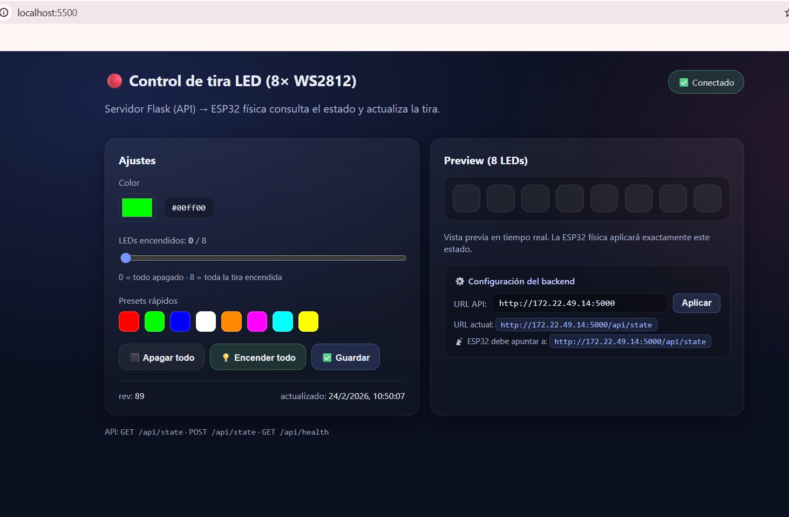

# Practica: Interfaz Web Flask + Servidor Front para Control de LED en ESP32 Fisica

## Descripcion General

Esta practica documenta el proceso de creacion de una interfaz web para controlar una tira de LEDs NeoPixel WS2812B conectada a un ESP32 fisico. Se implemento una arquitectura de dos servidores separados: un backend Flask que expone una API REST, y un frontend estatico HTML/JS/CSS que consume dicha API. La ESP32 consulta el estado del servidor cada 500 ms y aplica el color y cantidad de LEDs indicados.

---

## 1. Conceptos Fundamentales

| Concepto | Descripcion |
|----------|-------------|
| **Flask** | Microframework de Python para crear servidores web y APIs REST |
| **CORS** | Politica del navegador que permite o bloquea peticiones entre distintos origenes |
| **API REST** | Interfaz de comunicacion basada en HTTP con metodos GET y POST |
| **Polling** | Tecnica en la que el cliente consulta periodicamente al servidor para detectar cambios |
| **NeoPixel WS2812B** | LEDs RGB direccionables individualmente mediante un solo pin de datos |
| **IP Local** | Direccion de red dentro de una LAN, usada para comunicar dispositivos sin internet |
| **Servidor Front** | Servidor que sirve archivos estaticos (HTML, CSS, JS) al navegador |

---

## 2. Arquitectura del Sistema

```
[Navegador / iPad / Celular]
        |
        | HTTP POST /api/state
        v
[Servidor Front :5500]     [Backend Flask :5000]
  index.html          <-->  GET  /api/state
  app.js                    POST /api/state
  styles.css
                                  ^
                                  | HTTP GET cada 500 ms
                                  |
                           [ESP32 Fisica]
                           Tira WS2812B (8 LEDs)
```


---

## 3. Tecnologias y Herramientas

| Componente | Especificacion |
|------------|----------------|
| Lenguaje Backend | Python 3 + Flask |
| Lenguaje Frontend | HTML5 + CSS3 + JavaScript (vanilla) |
| Libreria CORS | flask-cors |
| Microcontrolador | ESP32 |
| Tira LED | WS2812B - 8 LEDs (NeoPixel) |
| Libreria Arduino | Adafruit NeoPixel + ArduinoJson |
| Puerto Backend | 5000 |
| Puerto Frontend | 5500 |
| Protocolo | HTTP / TCP-IP |

---

## 4. Estructura del Proyecto
Proyecto .zip para descargar: [Flask Local](assets/files/index.html)
```
├── backend/
│   ├── app.py              <- API Flask (solo backend)
│   ├── requirements.txt
│   ├── Procfile
│   └── data/
│       └── state.json      <- Estado persistente del LED
├── frontend/
│   ├── index.html          <- Interfaz de control
│   ├── app.js              <- Logica del frontend
│   └── styles.css          <- Estilos
└── esp32-led-fisico.ino    <- Codigo Arduino
```

---

## 5. Desarrollo Tecnico

### Etapa 1 - Configuracion del Backend Flask

El archivo `app.py` expone dos endpoints principales sin servir ningun archivo estatico. CORS esta abierto para permitir peticiones desde cualquier origen.

**Endpoints:**

| Metodo | Ruta | Descripcion |
|--------|------|-------------|
| GET | `/api/state` | Devuelve el estado actual `{color, count, rev}` |
| POST | `/api/state` | Recibe `{color, count}` y actualiza el estado |
| GET | `/api/health` | Verificacion de que el servidor esta activo |

**Codigo `app.py`:**

Archivo app.py para descargar: [ app.py](assets/files/app.py)
```python

    from __future__ import annotations
        import json
        import os
        import re
        import tempfile
        from datetime import datetime, timezone
        from flask import Flask, request, jsonify, send_from_directory

        APP_DIR = os.path.dirname(os.path.abspath(__file__))
        DATA_DIR = os.path.join(APP_DIR, "data")

        # ✅ Archivo final
        STATE_FILE = os.path.join(DATA_DIR, "state.json")

        # ✅ Posibles nombres anteriores (por si ya existen)
        LEGACY_FILES = [
        os.path.join(DATA_DIR, "state.jsonq"),
        os.path.join(DATA_DIR, "state.txt"),
        ]

        HEX_COLOR_RE = re.compile(r"^#[0-9a-fA-F]{6}$")
        LED_MIN, LED_MAX = 0, 8

        app = Flask(__name__, static_folder="static")


        def now_iso() -> str:
        return datetime.now(timezone.utc).isoformat()


        def atomic_write_text(path: str, text: str) -> None:
        os.makedirs(os.path.dirname(path), exist_ok=True)
        fd, tmp_path = tempfile.mkstemp(prefix="state_", suffix=".tmp", dir=os.path.dirname(path))
        try:
                with os.fdopen(fd, "w", encoding="utf-8") as f:
                f.write(text)
                os.replace(tmp_path, path)  # escritura atómica
        finally:
                if os.path.exists(tmp_path):
                try:
                        os.remove(tmp_path)
                except OSError:
                        pass


        def default_state() -> dict:
        return {"color": "#ff0000", "count": 8, "rev": 1, "updated_at": now_iso()}


        def migrate_legacy_if_needed() -> None:
        """
        Si no existe state.json, pero existe alguno de los legacy,
        lo migra a state.json.
        """
        os.makedirs(DATA_DIR, exist_ok=True)
        if os.path.exists(STATE_FILE):
                return

        for legacy in LEGACY_FILES:
                if os.path.exists(legacy):
                try:
                        # Intento 1: renombrar tal cual (rápido)
                        os.replace(legacy, STATE_FILE)
                        return
                except Exception:
                        # Intento 2: copiar contenido
                        try:
                        with open(legacy, "r", encoding="utf-8") as f:
                                content = f.read()
                        atomic_write_text(STATE_FILE, content)
                        return
                        except Exception:
                        pass


        def load_state() -> dict:
        os.makedirs(DATA_DIR, exist_ok=True)
        migrate_legacy_if_needed()

        if not os.path.exists(STATE_FILE):
                st = default_state()
                atomic_write_text(STATE_FILE, json.dumps(st, ensure_ascii=False))
                return st

        try:
                with open(STATE_FILE, "r", encoding="utf-8") as f:
                st = json.load(f)

                # defaults por si falta algo
                st.setdefault("color", "#ff0000")
                st.setdefault("count", 8)
                st.setdefault("rev", 1)
                st.setdefault("updated_at", now_iso())
                return st
        except Exception:
                # Si se corrompe, reinicia seguro
                st = default_state()
                atomic_write_text(STATE_FILE, json.dumps(st, ensure_ascii=False))
                return st


        def validate_state(color: str, count: int) -> tuple[bool, str]:
        if not isinstance(color, str) or not HEX_COLOR_RE.match(color):
                return False, "color inválido. Usa formato #RRGGBB"
        if not isinstance(count, int) or not (LED_MIN <= count <= LED_MAX):
                return False, f"count inválido. Debe estar entre {LED_MIN} y {LED_MAX}"
        return True, ""


        @app.get("/")
        def index():
        return send_from_directory(app.static_folder, "index.html")


        @app.get("/api/state")
        def get_state():
        return jsonify(load_state())


        @app.post("/api/state")
        def set_state():
        payload = request.get_json(silent=True) or {}
        color = payload.get("color")
        count = payload.get("count")

        try:
                count = int(count)
        except Exception:
                count = count

        ok, msg = validate_state(color, count)
        if not ok:
                return jsonify({"ok": False, "error": msg}), 400

        st = load_state()
        st["color"] = color
        st["count"] = count
        st["rev"] = int(st.get("rev", 1)) + 1
        st["updated_at"] = now_iso()

        atomic_write_text(STATE_FILE, json.dumps(st, ensure_ascii=False))
        return jsonify({"ok": True, **st})


        if __name__ == "__main__":
        port = int(os.environ.get("PORT", 5000))
        debug = os.environ.get("FLASK_ENV") != "production"
        app.run(host="0.0.0.0", port=port, debug=debug)        

#      
```
Captura de pantalla del servidor corriendo en terminal

---

### Etapa 2 - Configuracion del Frontend

El frontend es completamente independiente del backend. Se comunica con el mediante `fetch()` apuntando a la IP y puerto del servidor Flask.

**Configuracion de la URL del backend en `app.js`:**

```javascript
const DEFAULT_API = "http://TU_IP:5000";
```

**Codigo `index.html`:**
Archivo index.html para descargar: [index.html](assets/files/index1.html)
```html
<!-- [<!doctype html>
<html lang="es">
<head>
  <meta charset="utf-8" />
  <meta name="viewport" content="width=device-width,initial-scale=1" />
  <title>LED Controller (8x WS2812)</title>
  <link rel="stylesheet" href="/static/styles.css" />
</head>
<body>
  <div class="wrap">
    <header class="top">
      <div>
        <h1>Control de tira LED (8)</h1>
        <p class="muted">Servidor local (Flask) → ESP32 consulta estado y actualiza la tira.</p>
      </div>
      <div class="badge" id="netBadge">Conectando…</div>
    </header>

    <main class="grid">
      <section class="card">
        <h2>Ajustes</h2>

        <div class="field">
          <label for="color">Color</label>
          <div class="row">
            <input id="color" type="color" value="#ff0000" />
            <div class="code" id="colorHex">#ff0000</div>
          </div>
        </div>

        <div class="field">
          <label for="count">LEDs encendidos: <span class="strong" id="countLabel">8</span>/8</label>
          <input id="count" type="range" min="0" max="8" step="1" value="8" />
          <div class="hint">Tip: 0 apaga todo, 8 enciende toda la tira.</div>
        </div>

        <div class="actions">
          <button class="btn" id="btnOff">Apagar</button>
          <button class="btn primary" id="btnSave">Guardar</button>
        </div>

        <div class="status">
          <div><span class="muted">rev:</span> <span id="rev">—</span></div>
          <div><span class="muted">updated:</span> <span id="updatedAt">—</span></div>
        </div>
      </section>

      <section class="card">
        <h2>Preview (8 LEDs)</h2>
        <div class="strip" id="strip"></div>
        <p class="muted small">
          Esto es solo una vista previa. El ESP32 aplicará el mismo estado al hardware.
        </p>
      </section>
    </main>

    <footer class="foot muted">
      API: <span class="mono">GET /api/state</span> · <span class="mono">POST /api/state</span>
    </footer>
  </div>

  <script src="/static/app.js"></script>
</body>
</html>
] -->
```

**Codigo `app.js`:**
Archivo app.js para descargar: [app.js](assets/files/app.js)
```javascript
        // [const elColor = document.getElementById("color");
        const elHex = document.getElementById("colorHex");
        const elCount = document.getElementById("count");
        const elCountLabel = document.getElementById("countLabel");
        const elStrip = document.getElementById("strip");
        const elBadge = document.getElementById("netBadge");
        const elRev = document.getElementById("rev");
        const elUpdatedAt = document.getElementById("updatedAt");

        const btnOff = document.getElementById("btnOff");
        const btnSave = document.getElementById("btnSave");

        let current = { color: "#ff0000", count: 8, rev: null, updated_at: null };
        let sendTimer = null;

        function clamp(n, a, b) { return Math.max(a, Math.min(b, n)); }

        function renderPreview() {
        elHex.textContent = current.color.toLowerCase();
        elCountLabel.textContent = String(current.count);

        elStrip.innerHTML = "";
        for (let i = 0; i < 8; i++) {
        const d = document.createElement("div");
        d.className = "led";
        if (i < current.count) d.style.background = current.color;
        elStrip.appendChild(d);
        }

        elRev.textContent = current.rev ?? "—";
        elUpdatedAt.textContent = current.updated_at ? new Date(current.updated_at).toLocaleString() : "—";
        }

        function setBadge(ok, text) {
        elBadge.textContent = text;
        elBadge.style.borderColor = ok ? "rgba(100,255,180,.25)" : "rgba(255,120,120,.25)";
        elBadge.style.background = ok ? "rgba(100,255,180,.10)" : "rgba(255,120,120,.10)";
        }

        async function loadState() {
        try {
        const r = await fetch("/api/state", { cache: "no-store" });
        if (!r.ok) throw new Error(`HTTP ${r.status}`);
        const st = await r.json();
        current.color = st.color;
        current.count = clamp(parseInt(st.count, 10) || 0, 0, 8);
        current.rev = st.rev ?? null;
        current.updated_at = st.updated_at ?? null;

        elColor.value = current.color;
        elCount.value = current.count;

        renderPreview();
        setBadge(true, "Conectado");
        } catch (e) {
        setBadge(false, "Sin conexión");
        }
        }

        async function saveState() {
        try {
        const payload = { color: current.color, count: current.count };
        const r = await fetch("/api/state", {
        method: "POST",
        headers: { "Content-Type": "application/json" },
        body: JSON.stringify(payload),
        });
        const out = await r.json();
        if (!r.ok) throw new Error(out?.error || `HTTP ${r.status}`);

        current.rev = out.rev ?? current.rev;
        current.updated_at = out.updated_at ?? current.updated_at;

        renderPreview();
        setBadge(true, "Guardado");
        } catch (e) {
        setBadge(false, "Error al guardar");
        console.error(e);
        }
        }

        // Guarda con debounce (para no spamear el server mientras arrastras el slider)
        function scheduleSave(delayMs = 180) {
        clearTimeout(sendTimer);
        sendTimer = setTimeout(() => saveState(), delayMs);
        }

        elColor.addEventListener("input", () => {
        current.color = elColor.value;
        renderPreview();
        scheduleSave();
        });

        elCount.addEventListener("input", () => {
        current.count = clamp(parseInt(elCount.value, 10) || 0, 0, 8);
        renderPreview();
        scheduleSave();
        });

        btnOff.addEventListener("click", () => {
        current.count = 0;
        elCount.value = 0;
        renderPreview();
        saveState();
        });

        btnSave.addEventListener("click", () => saveState());

        // init
        renderPreview();
        loadState();]
```
Captura de pantalla del servidor corriendo en terminal:


Captura de la interfaz web en el navegador:


---

### Etapa 3 - Codigo Arduino (ESP32)

La ESP32 se conecta al WiFi, y en el `loop()` consulta el endpoint `/api/state` cada 500 ms. Si el campo `rev` cambio respecto al ultimo valor conocido, aplica el nuevo color y cantidad a la tira NeoPixel.

**Parametros configurados en el `.ino`:**

```cpp
const char* WIFI_SSID = "TU_RED";
const char* WIFI_PASS = "TU_PASSWORD";
const char* STATE_URL = "http://TU_IP:5000/api/state";
```

**Codigo completo `esp32-led-fisico.ino`:**

```cpp
// [Pegar aqui el contenido del .ino]
```

**Diagrama de conexion fisica (wiring):**

| ESP32 | Tira WS2812B |
|-------|--------------|
| GPIO 5 | DIN |
| GND | GND |
| Fuente 5V externa | VCC |

> _[Insertar foto del circuito fisico / wiring real]_

---

### Etapa 4 - Arranque de los Servidores

Se requieren **dos terminales abiertas simultaneamente**.

**Terminal 1 - Backend:**

```bash
cd backend
pip install flask flask-cors
python app.py
```

Salida esperada:
```
API corriendo en      http://0.0.0.0:5000
ESP32 apunta a        http://TU_IP:5000/api/state
```

> _[Insertar captura de la terminal del backend]_

**Terminal 2 - Frontend:**

```bash
cd frontend
python -m http.server 5500 --bind 0.0.0.0
```

Salida esperada:
```
Serving HTTP on 0.0.0.0 port 5500 ...
```

> _[Insertar captura de las dos terminales corriendo al mismo tiempo]_

---

### Etapa 5 - Flasheo de la ESP32

1. Abrir `esp32-led-fisico.ino` en Arduino IDE
2. Seleccionar placa: `Tools > Board > ESP32 Dev Module`
3. Seleccionar puerto COM correcto
4. Presionar **Upload**
5. Abrir Monitor Serial a **115200 baud**

**Salida esperada en Monitor Serial:**

```
[WiFi] Conectando.....
[WiFi] Conectado - IP: 192.168.x.x
[LED] rev=2  color=#ff0000  count=8
```

> _[Insertar captura del Monitor Serial]_

---

## 6. Resultados y Evidencia

### Interfaz web funcionando en PC

> _[Insertar captura de la interfaz en el navegador de la PC con badge "Conectado"]_

### Interfaz web funcionando desde otro dispositivo

Acceso desde dispositivo externo en la misma red WiFi:

```
http://TU_IP:5500/index.html
```

> _[Insertar captura de la interfaz desde el iPad o celular]_

### ESP32 respondiendo a los cambios

> _[Insertar foto de la tira LED encendida con el color seleccionado desde la web]_

### Logs del backend mostrando el polling de la ESP32

> _[Insertar captura de la terminal con los GET /api/state cada 500 ms]_

---

## 7. Nota Tecnica - Firewall

Para que otros dispositivos en la red puedan acceder a los servidores, fue necesario abrir los puertos en el Firewall de Windows ejecutando los siguientes comandos en **PowerShell como administrador**:

```powershell
netsh advfirewall firewall add rule name="Flask 5000" dir=in action=allow protocol=TCP localport=5000
netsh advfirewall firewall add rule name="Front 5500" dir=in action=allow protocol=TCP localport=5500
```

---

## 8. Analisis y Discusion

### Diferencia entre servidor local y servidor remoto

El servidor Flask local esta disponible unicamente dentro de la red WiFi donde corre la PC. A diferencia de un servicio en la nube (como Render o Railway), no requiere internet externo, lo que lo hace ideal para laboratorio y prototipado con hardware fisico como la ESP32.

### Integracion con Sistemas Ciberfisicos

Esta arquitectura demuestra un patron clasico de sistemas ciberfisicos: un actuador fisico (tira LED) es controlado en tiempo real a traves de una interfaz web, con la logica de estado centralizada en un servidor intermedio. La ESP32 actua como cliente HTTP que sincroniza su estado con el servidor.

### IP dinamica como limitacion

Durante la practica se observo que la IP local de la PC cambia al reiniciar o cambiar de red. Para un sistema mas robusto seria conveniente asignar una IP estatica a la PC dentro del router, o usar un servicio de DNS local.

### Latencia del sistema

Con un intervalo de polling de 500 ms, el tiempo maximo de respuesta desde que el usuario mueve un slider hasta que el LED cambia es de aproximadamente **500-700 ms**, lo cual es aceptable para esta aplicacion.

---

## 9. Conclusiones

> _[Escribir conclusiones personales aqui]_

---

## 10. Referencias

- Documentacion oficial de Flask: https://flask.palletsprojects.com
- Libreria Adafruit NeoPixel: https://github.com/adafruit/Adafruit_NeoPixel
- ArduinoJson: https://arduinojson.org
- _[Agregar mas referencias segun sea necesario]_