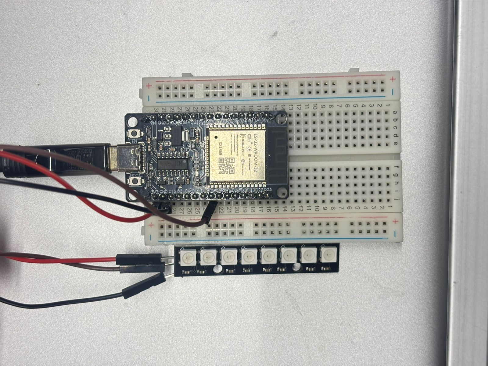
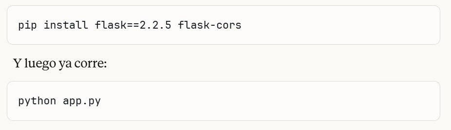
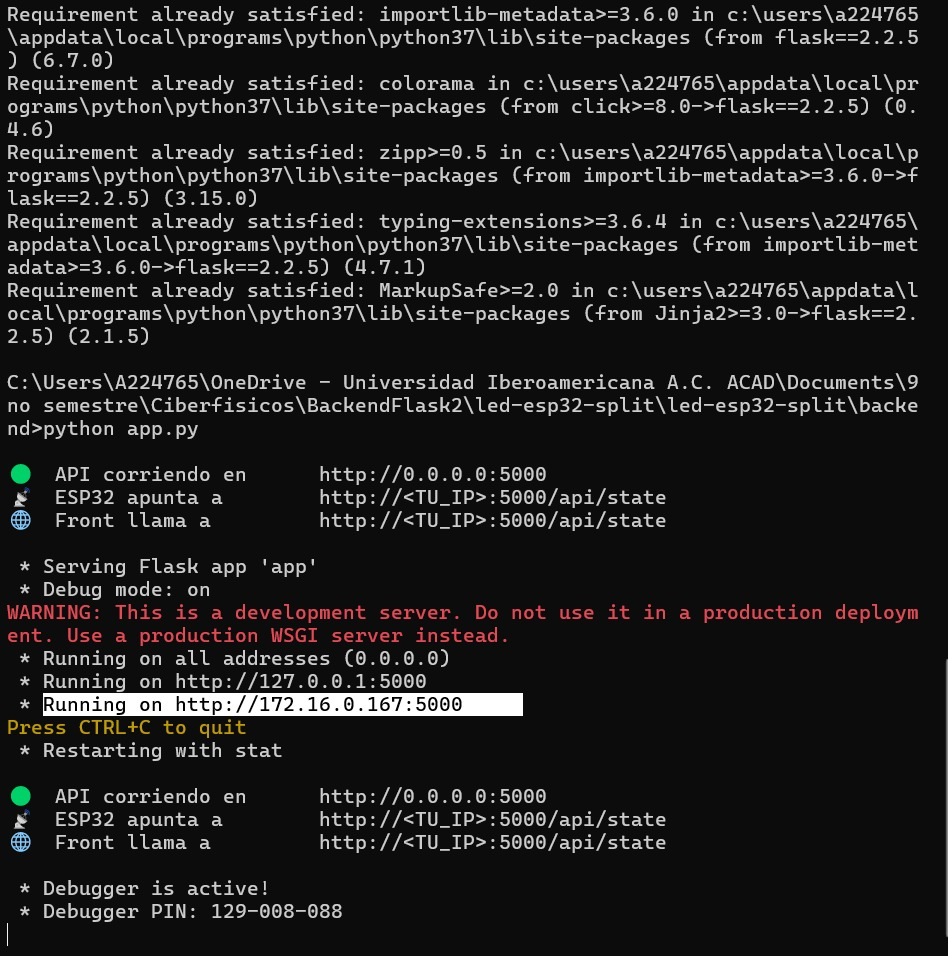
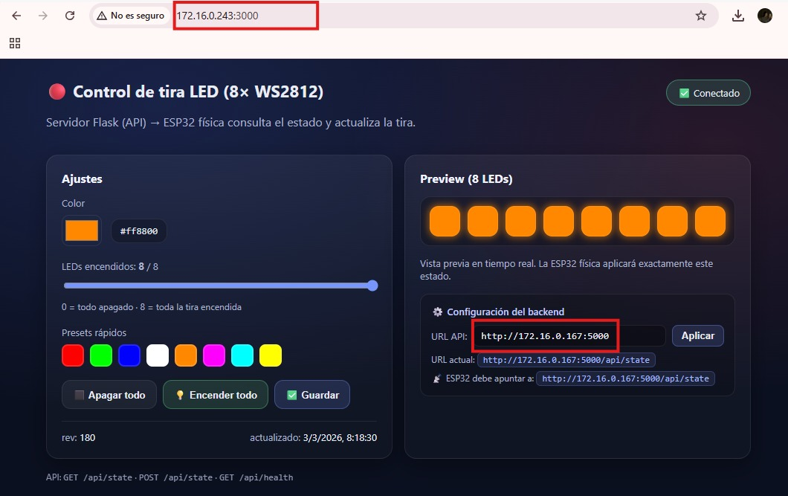

# Práctica: Control de Tira LED con ESP32 vía Red Local (Frontend/Backend en PCs distintas)

## 1. Objetivo

Diseñar e implementar un sistema de control de una tira LED WS2812B conectada a una ESP32, donde la interfaz gráfica (frontend) y el servidor de control (backend) corren en **computadoras físicamente distintas** dentro de la misma red local, demostrando la separación de responsabilidades en arquitecturas cliente-servidor aplicadas a sistemas ciberfísicos.

### Objetivos específicos

- Desplegar un servidor Flask (API REST) en una PC dedicada al backend.
- Servir la interfaz web desde una segunda PC con una IP diferente.
- Conectar la ESP32 a la misma red para hacer polling al backend y controlar la tira LED en tiempo real.
- Validar la comunicación entre los tres nodos: Frontend → Backend ← ESP32.

---

## 2. Arquitectura del Sistema

```
[PC Frontend : 172.16.0.243:3000]
        │
        │  HTTP POST /api/state  (color, count)
        ▼
[PC Backend : 172.16.0.167:5000]   ←── HTTP GET /api/state (polling 500ms) ── [ESP32]
        │                                                                            │
        │  state.json (persistencia)                                                 ▼
        └────────────────────────────────────────────────────────────────► Tira LED WS2812B
```

| Nodo | IP | Puerto | Tecnología |
|---|---|---|---|
| Frontend | 172.16.0.243 | 3000 | HTML + CSS + JS (http.server) |
| Backend | 172.16.0.167 | 5000 | Python Flask + Flask-CORS |
| ESP32 | DHCP (WiFi) | — | Arduino C++ |

Sistema físico:

---

## 3. Componentes y Materiales

| Componente | Especificación |
|---|---|
| Microcontrolador | ESP32 Dev Module |
| Tira LED | WS2812B (8 LEDs) |
| Backend | Python 3.x + Flask 2.2.5 + Flask-CORS |
| Frontend | HTML5 / CSS3 / JavaScript vanilla |
| Red | WiFi LAN compartida entre ambas PCs y ESP32 |
| IDE Arduino | Arduino IDE 2.x con soporte ESP32 by Espressif |

---

## 4. Estructura del Proyecto
Proyecto .zip para descargar: [Flask Backend y Fronted Remoto](assets/files/FlaskRemoto.zip)
```
led-esp32-split/
├── backend/
│   ├── app.py              # Servidor Flask (API REST)
│   ├── requirements.txt    # Dependencias Python
│   └── data/
│       └── state.json      # Estado persistente del LED
├── frontend/
│   ├── index.html          # Interfaz de usuario
│   ├── app.js              # Lógica de comunicación con el backend
│   └── styles.css          # Estilos visuales
└── esp32-led-fisico.ino    # Firmware de la ESP32
```

---

## 5. Desarrollo

### 5.1 Backend — Servidor Flask

El backend expone tres endpoints REST:

| Método | Endpoint | Descripción |
|---|---|---|
| GET | `/api/state` | Devuelve el estado actual (color + cantidad de LEDs) |
| POST | `/api/state` | Actualiza el estado desde el frontend |
| GET | `/api/health` | Health check del servidor |

El servidor usa `CORS(app, resources={r"/api/*": {"origins": "*"}})` para permitir peticiones desde cualquier origen, lo que es fundamental cuando frontend y backend están en IPs distintas.

#### Código del backend (`app.py`)
Archivo app.py para descargar: [app.py](assets/files/app2.py)

```python
# ["""
LED Controller — Backend Flask (solo API)
─────────────────────────────────────────
NO sirve archivos estáticos. Solo expone la API con CORS abierto.
El front corre por separado (Live Server, http.server, Netlify, etc.)

Endpoints:
  GET  /api/state   → La ESP32 física hace polling aquí cada 500 ms
  POST /api/state   → El front envía el nuevo color/count
  GET  /api/health  → Health check
"""

from __future__ import annotations
import json
import os
import re
import tempfile
from datetime import datetime, timezone

from flask import Flask, request, jsonify
from flask_cors import CORS

# ─── Rutas ────────────────────────────────────────────────────────────────────
APP_DIR    = os.path.dirname(os.path.abspath(__file__))
DATA_DIR   = os.path.join(APP_DIR, "data")
STATE_FILE = os.path.join(DATA_DIR, "state.json")

HEX_COLOR_RE = re.compile(r"^#[0-9a-fA-F]{6}$")
LED_MIN, LED_MAX = 0, 8

# ─── App ──────────────────────────────────────────────────────────────────────
app = Flask(__name__)

# CORS abierto: el front puede estar en cualquier origen
# (Live Server, file://, Netlify, GitHub Pages, etc.)
CORS(app, resources={r"/api/*": {"origins": "*"}})


# ─── Helpers ──────────────────────────────────────────────────────────────────

def now_iso() -> str:
    return datetime.now(timezone.utc).isoformat()


def atomic_write(path: str, text: str) -> None:
    os.makedirs(os.path.dirname(path), exist_ok=True)
    fd, tmp = tempfile.mkstemp(prefix="state_", suffix=".tmp", dir=os.path.dirname(path))
    try:
        with os.fdopen(fd, "w", encoding="utf-8") as f:
            f.write(text)
        os.replace(tmp, path)
    finally:
        if os.path.exists(tmp):
            try:
                os.remove(tmp)
            except OSError:
                pass


def default_state() -> dict:
    return {"color": "#ff0000", "count": 0, "rev": 1, "updated_at": now_iso()}


def load_state() -> dict:
    os.makedirs(DATA_DIR, exist_ok=True)
    if not os.path.exists(STATE_FILE):
        st = default_state()
        atomic_write(STATE_FILE, json.dumps(st))
        return st
    try:
        with open(STATE_FILE, "r", encoding="utf-8") as f:
            st = json.load(f)
        st.setdefault("color", "#ff0000")
        st.setdefault("count", 0)
        st.setdefault("rev", 1)
        st.setdefault("updated_at", now_iso())
        return st
    except Exception:
        st = default_state()
        atomic_write(STATE_FILE, json.dumps(st))
        return st


def validate_state(color: str, count) -> tuple[bool, str]:
    if not isinstance(color, str) or not HEX_COLOR_RE.match(color):
        return False, "color inválido — usa formato #RRGGBB"
    try:
        count = int(count)
    except Exception:
        return False, "count debe ser un número entero"
    if not (LED_MIN <= count <= LED_MAX):
        return False, f"count inválido — debe estar entre {LED_MIN} y {LED_MAX}"
    return True, ""


# ─── Endpoints ────────────────────────────────────────────────────────────────

@app.get("/api/state")
def get_state():
    """
    Usado por:
      - La ESP32 física (polling cada 500 ms)
      - El front al cargar la página (GET inicial)
    """
    return jsonify(load_state())


@app.post("/api/state")
def set_state():
    """
    Usado por el front cuando el usuario mueve sliders o presiona botones.
    Body JSON esperado: { "color": "#RRGGBB", "count": 0-8 }
    """
    payload = request.get_json(silent=True) or {}
    color = payload.get("color")
    count = payload.get("count")

    ok, msg = validate_state(color, count)
    if not ok:
        return jsonify({"ok": False, "error": msg}), 400

    st = load_state()
    st["color"]      = color
    st["count"]      = int(count)
    st["rev"]        = int(st.get("rev", 1)) + 1
    st["updated_at"] = now_iso()

    atomic_write(STATE_FILE, json.dumps(st))
    return jsonify({"ok": True, **st})


@app.get("/api/health")
def health():
    return jsonify({"status": "ok", "time": now_iso()})


# ─── Arranque ─────────────────────────────────────────────────────────────────

if __name__ == "__main__":
    port  = int(os.environ.get("PORT", 5000))
    debug = os.environ.get("FLASK_ENV") != "production"
    print(f"\n🟢  API corriendo en      http://0.0.0.0:{port}")
    print(f"📡  ESP32 apunta a        http://<TU_IP>:{port}/api/state")
    print(f"🌐  Front llama a         http://<TU_IP>:{port}/api/state\n")
    app.run(host="0.0.0.0", port=port, debug=debug)]
```

#### Captura del backend corriendo
Comando para correr en terminal:


Captura de la terminal con Flask corriendo y la IP visible:

---

### 5.2 Frontend — Interfaz Web

La interfaz permite:
- Cambiar el color de los LEDs con un color picker.
- Ajustar la cantidad de LEDs encendidos (0–8) con un slider.
- Ver el estado de conexión en tiempo real (✅ Conectado / ❌ Sin conexión).
- Cambiar la URL del backend desde la propia interfaz sin editar código.

La línea clave en `app.js` que apunta al backend es:

```javascript
const DEFAULT_API = "http://172.16.0.167:5000";
```

El frontend se sirve desde la segunda PC con:

```bash
cd frontend
python -m http.server 3000
```

Y se accede desde el navegador en:

```
http://172.16.0.243:3000
```

#### Código del frontend (`app.js`)
Código app.js para descargar: [app.js](assets/files/app2.js)
```javascript
// [// ─── URL del backend Flask ────────────────────────────────────────────────────
// Cambia esta línea con la IP/URL de tu servidor Flask
// Ejemplos:
//   Local:  "http://192.168.1.10:5000"
//   Render: "https://tu-app.onrender.com"
const DEFAULT_API = "http://172.16.0.167:5000";

// ─── Persistencia de la URL en localStorage ───────────────────────────────────
let API_BASE = localStorage.getItem("led_api_base") || DEFAULT_API;

// ─── Elementos DOM ────────────────────────────────────────────────────────────
const elColor      = document.getElementById("color");
const elHex        = document.getElementById("colorHex");
const elCount      = document.getElementById("count");
const elCountLabel = document.getElementById("countLabel");
const elStrip      = document.getElementById("strip");
const elBadge      = document.getElementById("netBadge");
const elRev        = document.getElementById("rev");
const elUpdatedAt  = document.getElementById("updatedAt");
const elApiInput   = document.getElementById("apiInput");
const elApiDisplay = document.getElementById("apiDisplay");
const elEsp32Url   = document.getElementById("esp32Url");
const btnSetApi    = document.getElementById("btnSetApi");
const btnOff       = document.getElementById("btnOff");
const btnFull      = document.getElementById("btnFull");
const btnSave      = document.getElementById("btnSave");

// ─── Estado local ─────────────────────────────────────────────────────────────
let current   = { color: "#ff0000", count: 0, rev: null, updated_at: null };
let saveTimer = null;

// ─── Init UI de URL ───────────────────────────────────────────────────────────
function refreshApiUi() {
  elApiInput.value      = API_BASE;
  elApiDisplay.textContent = `${API_BASE}/api/state`;
  elEsp32Url.textContent   = `${API_BASE}/api/state`;
}
refreshApiUi();

// ─── Utilidades ───────────────────────────────────────────────────────────────
const clamp = (n, a, b) => Math.max(a, Math.min(b, n));

function renderPreview() {
  elHex.textContent        = current.color.toLowerCase();
  elCountLabel.textContent = String(current.count);

  elStrip.innerHTML = "";
  for (let i = 0; i < 8; i++) {
    const d = document.createElement("div");
    d.className = "led";
    if (i < current.count) {
      d.style.background = current.color;
      d.style.boxShadow  = `0 0 10px 2px ${current.color}88`;
    }
    elStrip.appendChild(d);
  }

  elRev.textContent       = current.rev ?? "—";
  elUpdatedAt.textContent = current.updated_at
    ? new Date(current.updated_at).toLocaleString()
    : "—";
}

function setBadge(ok, text) {
  elBadge.textContent = text;
  elBadge.style.borderColor = ok
    ? "rgba(100,255,180,.35)"
    : "rgba(255,120,120,.35)";
  elBadge.style.background = ok
    ? "rgba(100,255,180,.12)"
    : "rgba(255,120,120,.12)";
}

// ─── API calls ────────────────────────────────────────────────────────────────
async function loadState() {
  try {
    const r  = await fetch(`${API_BASE}/api/state`, { cache: "no-store" });
    if (!r.ok) throw new Error(`HTTP ${r.status}`);
    const st = await r.json();

    current.color      = st.color;
    current.count      = clamp(parseInt(st.count, 10) || 0, 0, 8);
    current.rev        = st.rev ?? null;
    current.updated_at = st.updated_at ?? null;

    elColor.value = current.color;
    elCount.value = current.count;

    renderPreview();
    setBadge(true, "✅ Conectado");
  } catch {
    setBadge(false, "❌ Sin conexión");
  }
}

async function saveState() {
  try {
    const r = await fetch(`${API_BASE}/api/state`, {
      method:  "POST",
      headers: { "Content-Type": "application/json" },
      body:    JSON.stringify({ color: current.color, count: current.count }),
    });
    const out = await r.json();
    if (!r.ok) throw new Error(out?.error || `HTTP ${r.status}`);

    current.rev        = out.rev ?? current.rev;
    current.updated_at = out.updated_at ?? current.updated_at;

    renderPreview();
    setBadge(true, "💾 Guardado");
    setTimeout(() => setBadge(true, "✅ Conectado"), 1500);
  } catch (e) {
    setBadge(false, "❌ Error al guardar");
    console.error(e);
  }
}

function scheduleSave(ms = 180) {
  clearTimeout(saveTimer);
  saveTimer = setTimeout(saveState, ms);
}

// ─── Eventos ──────────────────────────────────────────────────────────────────

// Cambiar URL del backend desde la UI
btnSetApi.addEventListener("click", () => {
  const val = elApiInput.value.trim().replace(/\/$/, ""); // quita slash final
  if (!val) return;
  API_BASE = val;
  localStorage.setItem("led_api_base", API_BASE);
  refreshApiUi();
  loadState();
});

elApiInput.addEventListener("keydown", e => {
  if (e.key === "Enter") btnSetApi.click();
});

elColor.addEventListener("input", () => {
  current.color = elColor.value;
  renderPreview();
  scheduleSave();
});

elCount.addEventListener("input", () => {
  current.count = clamp(parseInt(elCount.value, 10) || 0, 0, 8);
  renderPreview();
  scheduleSave();
});

btnOff.addEventListener("click", () => {
  current.count = 0;
  elCount.value = 0;
  renderPreview();
  saveState();
});

btnFull.addEventListener("click", () => {
  current.count = 8;
  elCount.value = 8;
  renderPreview();
  saveState();
});

btnSave.addEventListener("click", saveState);

document.querySelectorAll(".preset").forEach(btn => {
  btn.addEventListener("click", () => {
    current.color = btn.dataset.color;
    elColor.value = current.color;
    renderPreview();
    saveState();
  });
});

// ─── Init ─────────────────────────────────────────────────────────────────────
renderPreview();
loadState();
]
```

#### Captura de la interfaz en el navegador
Captura de la interfaz web con "✅ Conectado" visible]_

---

### 5.3 Firmware ESP32 (`esp32-led-fisico.ino`)

La ESP32 realiza polling cada 500 ms al endpoint `/api/state` del backend. Al recibir la respuesta JSON, interpreta el color hexadecimal y la cantidad de LEDs y actualiza la tira WS2812B en consecuencia.

Parámetros configurados en el `.ino`:

```cpp
const char* ssid      = "NOMBRE_DE_RED";
const char* password  = "CONTRASEÑA";
const char* serverUrl = "http://172.16.0.167:5000/api/state";
```

#### Código del firmware
Código esp32_led_fisico2.ino para descargar: [esp32_led_fisico2.ino](assets/files/esp32_led_fisico2.ino)


```cpp
// [#include <WiFi.h>
#include <HTTPClient.h>
#include <ArduinoJson.h>
#include <Adafruit_NeoPixel.h>

// ╔═══════════════════════════════════════════════════╗
// ║   CAMBIA ESTOS 3 DATOS ANTES DE FLASHEAR         ║
// ╚═══════════════════════════════════════════════════╝
const char* WIFI_SSID = "Primavera26";
const char* WIFI_PASS = "Ib3r02026pR1m";
const char* STATE_URL = "http://172.16.0.167:5000/api/state";
// ════════════════════════════════════════════════════

#define LED_PIN    5
#define LED_COUNT  8
#define BRIGHTNESS 80     // 0–255

Adafruit_NeoPixel strip(LED_COUNT, LED_PIN, NEO_GRB + NEO_KHZ800);

unsigned long lastPoll = 0;
const unsigned long POLL_MS = 100;
long lastRev = -1;

// ─── Helpers ──────────────────────────────────────────────────────────────────

uint32_t parseHexColor(const char* s) {
  if (!s || s[0] != '#' || strlen(s) != 7) return strip.Color(0, 0, 0);
  auto h = [](char c) -> uint8_t {
    if (c >= '0' && c <= '9') return c - '0';
    if (c >= 'a' && c <= 'f') return 10 + (c - 'a');
    if (c >= 'A' && c <= 'F') return 10 + (c - 'A');
    return 0;
  };
  return strip.Color(
    h(s[1]) * 16 + h(s[2]),
    h(s[3]) * 16 + h(s[4]),
    h(s[5]) * 16 + h(s[6])
  );
}

void applyState(uint32_t color, int count) {
  count = constrain(count, 0, LED_COUNT);
  for (int i = 0; i < LED_COUNT; i++)
    strip.setPixelColor(i, (i < count) ? color : 0);
  strip.show();
}

bool fetchAndUpdate() {
  if (WiFi.status() != WL_CONNECTED) return false;

  HTTPClient http;
  http.begin(STATE_URL);
  http.setTimeout(3000);
  int code = http.GET();

  if (code != 200) {
    Serial.printf("[HTTP] Error: %d\n", code);
    http.end();
    return false;
  }

  String body = http.getString();
  http.end();

  StaticJsonDocument<256> doc;
  if (deserializeJson(doc, body)) {
    Serial.println("[JSON] Error de parseo");
    return false;
  }

  const char* colorStr = doc["color"] | "#000000";
  int  count = doc["count"] | 0;
  long rev   = doc["rev"]   | 0;

  if (rev == lastRev) return true;   // sin cambios
  lastRev = rev;

  Serial.printf("[LED] rev=%ld  color=%s  count=%d\n", rev, colorStr, count);
  applyState(parseHexColor(colorStr), count);
  return true;
}

void ensureWiFi() {
  if (WiFi.status() == WL_CONNECTED) return;

  Serial.print("[WiFi] Conectando");
  WiFi.mode(WIFI_STA);
  WiFi.begin(WIFI_SSID, WIFI_PASS);

  unsigned long t0 = millis();
  while (WiFi.status() != WL_CONNECTED && millis() - t0 < 10000) {
    delay(300); Serial.print(".");
  }

  if (WiFi.status() == WL_CONNECTED) {
    Serial.println("\n[WiFi] Conectado — IP: " + WiFi.localIP().toString());
    // Flash verde = conectado
    for (int i = 0; i < LED_COUNT; i++) strip.setPixelColor(i, strip.Color(0, 80, 0));
    strip.show(); delay(400);
    for (int i = 0; i < LED_COUNT; i++) strip.setPixelColor(i, 0);
    strip.show();
  } else {
    Serial.println("\n[WiFi] Fallo — revisa SSID/contraseña");
    // Flash rojo = error
    for (int i = 0; i < LED_COUNT; i++) strip.setPixelColor(i, strip.Color(80, 0, 0));
    strip.show(); delay(400);
    for (int i = 0; i < LED_COUNT; i++) strip.setPixelColor(i, 0);
    strip.show();
  }
}

// ─── Setup / Loop ─────────────────────────────────────────────────────────────

void setup() {
  Serial.begin(115200);
  delay(200);
  strip.begin();
  strip.setBrightness(BRIGHTNESS);
  strip.show();
  ensureWiFi();
}

void loop() {
  ensureWiFi();
  unsigned long now = millis();
  if (now - lastPoll >= POLL_MS) {
    lastPoll = now;
    fetchAndUpdate();
  }
} ]
```
---

## 6. Pasos de Instalación y Ejecución

### PC Backend

```bash
# 1. Navegar a la carpeta backend
cd "ruta/al/proyecto/backend"

# 2. Instalar dependencias
pip install flask==2.2.5 flask-cors

# 3. Correr el servidor
python app.py
```

### PC Frontend

```bash
# 1. Navegar a la carpeta frontend
cd "ruta/al/proyecto/frontend"

# 2. Servir los archivos estáticos
python -m http.server 3000
```

Abrir en el navegador: `http://<IP_PC_FRONTEND>:3000`

### ESP32

1. Abrir `esp32-led-fisico.ino` en Arduino IDE.
2. Instalar soporte ESP32: **Archivo → Preferencias → URLs adicionales:**
   ```
   https://raw.githubusercontent.com/espressif/arduino-esp32/gh-pages/package_esp32_index.json
   ```
3. Instalar placa: **Herramientas → Gestor de placas → esp32 by Espressif**
4. Cambiar `ssid`, `password` y `serverUrl` con los datos de la red y la IP del backend.
5. Seleccionar placa **ESP32 Dev Module** y el puerto correcto.
6. Subir el código.

---

## 7. Resultados

### Logs del backend durante la prueba

```
172.16.0.243 - - [03/Mar/2026 08:47:20] "OPTIONS /api/state HTTP/1.1" 200 -
172.16.0.243 - - [03/Mar/2026 08:47:20] "POST /api/state HTTP/1.1" 200 -
172.16.0.243 - - [03/Mar/2026 08:47:31] "GET /api/state HTTP/1.1" 200 -
```

Los logs confirman que:
- El frontend (`172.16.0.243`) envía `POST` al mover los controles.
- La ESP32 hace `GET` periódicos para leer el estado.

### Evidencia fotográfica

Video de la tira LED respondiendo a los cambios en la interfaz
<video controls width="720">
  <source src="{{ '/assets/videos/video2.mp4' | relative_url }}" type="video/mp4">
  Tu navegador no soporta video HTML5.
</video>

Captura del estado "✅ Conectado" en la interfaz

---

## 8. Análisis y Discusión

### Separación de responsabilidades

La arquitectura implementada replica un patrón real de sistemas distribuidos: el frontend solo se preocupa por la presentación y la captura de input del usuario, mientras que el backend gestiona el estado y la persistencia. La ESP32 es un cliente más de esa API, igual que lo es el navegador.

### CORS

Al correr frontend y backend en IPs distintas, el navegador aplica la política de mismo origen (Same-Origin Policy). Flask-CORS resuelve esto añadiendo los headers `Access-Control-Allow-Origin: *` a todas las respuestas de la API, lo que se evidencia en las peticiones `OPTIONS` (preflight) que aparecen en los logs antes de cada `POST`.

### Polling vs WebSockets

El firmware usa polling cada 500 ms, lo que introduce una latencia máxima de 500 ms entre que el usuario mueve un slider y los LEDs responden. Para aplicaciones de tiempo real más exigentes, una mejora sería usar WebSockets o Server-Sent Events (SSE) para que el backend notifique a la ESP32 en lugar de esperar a ser consultado.

### Persistencia con `state.json`

El estado se persiste en un archivo JSON local, lo que permite que la ESP32 recupere el último estado conocido si se reconecta después de una desconexión. La escritura se hace de forma atómica (archivo temporal + rename) para evitar corrupción.

---

## 9. Conclusiones

- Se logró separar correctamente frontend y backend en dos PCs con IPs distintas (`172.16.0.243` y `172.16.0.167`), demostrando que la arquitectura es independiente del host.
- La ESP32 se integró como un tercer cliente de la misma API REST, validando la interoperabilidad del sistema.
- CORS es un componente crítico en cualquier arquitectura web donde el cliente y el servidor tienen orígenes distintos.
- El patrón cliente-servidor con polling es funcional para este caso de uso, pero presenta limitaciones de latencia que se pueden resolver con comunicación por eventos.
