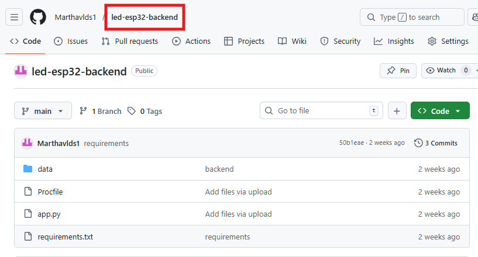
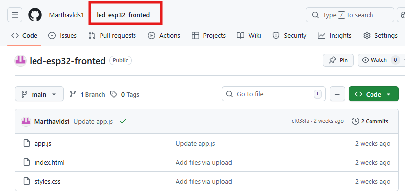
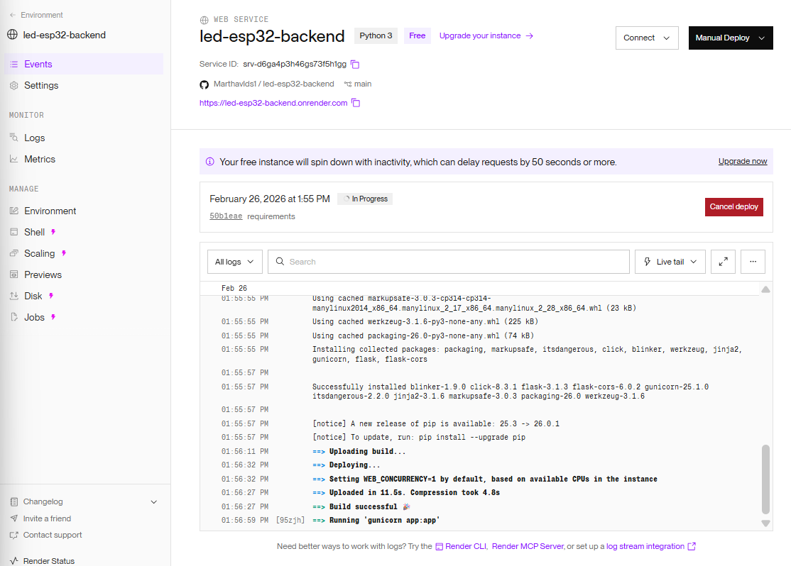
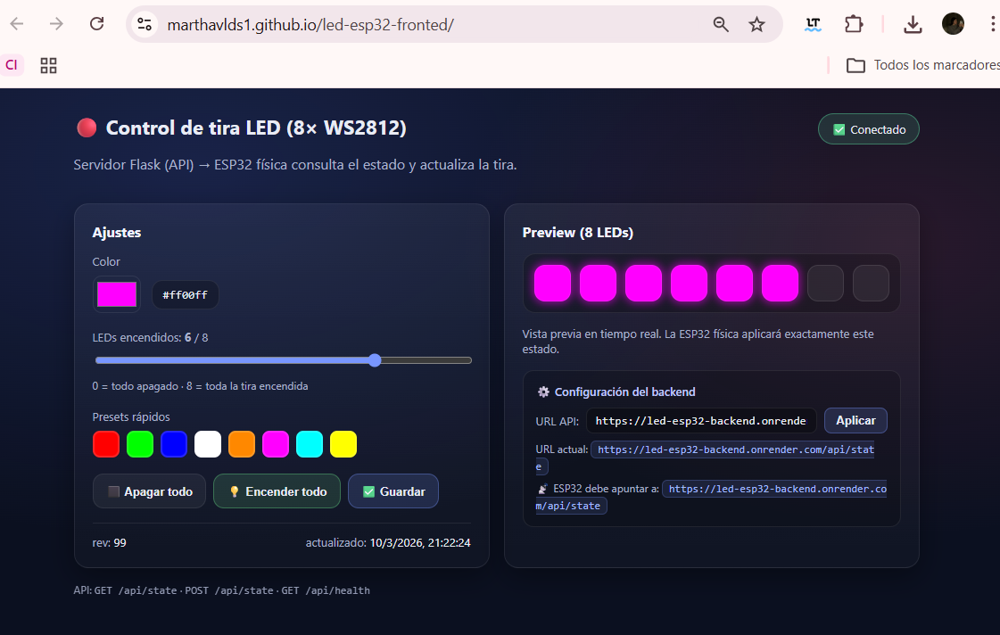

# Control Remoto de LED ESP32 con Flask y Despliegue en la Nube (Render + GitHub Pages)

En la ingeniería de sistemas ciberfísicos, la integración de hardware embebido con servicios web accesibles desde internet es un componente esencial del desarrollo IoT moderno. Este reporte detalla la creación de un sistema de control remoto para una tira de LEDs NeoPixel WS2812B conectada a un ESP32, utilizando un backend Flask como intermediario y desplegándolo en la nube mediante Render. Se analiza la evolución desde una comunicación local (LAN) hacia un acceso global a través de internet.


## 1. Objetivos

**General:** Diseñar un sistema IoT completo que permita el control remoto de LEDs físicos desde una interfaz web, eliminando la restricción de red local y permitiendo acceso desde cualquier lugar del mundo.

- Desplegar un backend Flask en Render que exponga una API REST para leer y escribir el estado de los LEDs.
- Crear un frontend web (HTML, CSS, JS) que consuma la API y permita controlar color y cantidad de LEDs activos.
- Programar el ESP32 para hacer polling periódico a la API y reflejar el estado en la tira NeoPixel física.
- Publicar el código fuente en dos repositorios separados de GitHub (backend y frontend).
- Alojar el frontend estático en GitHub Pages para acceso público sin costo.

---

## 2. Tecnologías y Herramientas

### ESP32 y NeoPixel WS2812B
El ESP32 es un microcontrolador con WiFi integrado ampliamente utilizado en proyectos IoT. Su conectividad permite realizar peticiones HTTP hacia servidores remotos. La tira NeoPixel WS2812B permite controlar color RGB y cantidad de LEDs activos de manera individual mediante un solo pin de datos (GPIO 5).

### Flask y API REST
Flask es un microframework de Python para la creación rápida de APIs web. En este proyecto expone dos endpoints:
- `GET /api/state` — Devuelve el estado actual (color y cantidad de LEDs encendidos)
- `POST /api/state` — Actualiza el estado con nuevos valores enviados desde la interfaz

El estado se persiste en un archivo `state.json`, lo que garantiza que el ESP32 siempre consulte el último valor registrado.

### Render (Despliegue en la Nube)
Render es una plataforma de despliegue que permite hospedar aplicaciones web de forma gratuita. A diferencia de correr el servidor localmente, Render asigna una URL pública permanente accesible desde cualquier red. El servicio detecta automáticamente el archivo `Procfile` para iniciar la aplicación con Gunicorn.

### GitHub y GitHub Pages
Se utilizaron dos repositorios independientes:
- **`led-esp32-backend`** — Contiene la API Flask, conectado a Render para su despliegue automático.
- **`led-esp32-frontend`** — Contiene la interfaz web, publicada mediante GitHub Pages como sitio estático.

---

## 3. Componentes Usados

| Componente | Especificación |
|---|---|
| MCU | ESP32 (GPIO 5 como salida para datos NeoPixel) |
| Salidas | Tira NeoPixel WS2812B de 8 LEDs |
| Alimentación | Fuente 5V para la tira / USB para el ESP32 |
| IDE / Lenguaje (firmware) | Arduino IDE (C++) |
| IDE / Lenguaje (backend) | VS Code, Python 3, Flask |
| Librerías Arduino | Adafruit NeoPixel, ArduinoJson, WiFi, HTTPClient |
| Librerías Python | Flask, Flask-CORS, Gunicorn |
| Despliegue backend | Render (Free tier) |
| Despliegue frontend | GitHub Pages |

---

## 4. Desarrollo Técnico
Proyecto .zip para descargar: [Render](assets/files/Render.zip)

### Etapa 1. Estructura del Proyecto y Repositorios

El proyecto se dividió en dos repositorios para separar responsabilidades y permitir despliegues independientes:

```
led-esp32-backend/
├── app.py              ← Servidor Flask con la API REST
├── Procfile            ← Instrucción de inicio para Render
├── requirements.txt    ← Dependencias Python (flask, flask-cors, gunicorn)
└── data/
    └── state.json      ← Persistencia del estado de los LEDs


led-esp32-frontend/
├── index.html          ← Interfaz de usuario
├── styles.css          ← Estilos visuales
└── app.js              ← Lógica de consumo de la API
```
Captura de repositorio Backend en GitHub:



Captura de repositorio Fronted en GitHub:



---

### Etapa 2. Backend Flask — API REST

El servidor Flask expone un recurso `/api/state` que permite leer y escribir el estado de los LEDs. Se habilitó CORS para permitir peticiones desde el frontend alojado en GitHub Pages.

**Codigo `app.py`:**
Archivo app.py para descargar: [ app.py](assets/files/app3.py)

```python
"""
LED Controller — Backend Flask (solo API)
─────────────────────────────────────────
NO sirve archivos estáticos. Solo expone la API con CORS abierto.
El front corre por separado (Live Server, http.server, Netlify, etc.)

Endpoints:
  GET  /api/state   → La ESP32 física hace polling aquí cada 500 ms
  POST /api/state   → El front envía el nuevo color/count
  GET  /api/health  → Health check
"""

from __future__ import annotations
import json
import os
import re
import tempfile
from datetime import datetime, timezone

from flask import Flask, request, jsonify
from flask_cors import CORS

# ─── Rutas ────────────────────────────────────────────────────────────────────
APP_DIR    = os.path.dirname(os.path.abspath(__file__))
DATA_DIR   = os.path.join(APP_DIR, "data")
STATE_FILE = os.path.join(DATA_DIR, "state.json")

HEX_COLOR_RE = re.compile(r"^#[0-9a-fA-F]{6}$")
LED_MIN, LED_MAX = 0, 8

# ─── App ──────────────────────────────────────────────────────────────────────
app = Flask(__name__)

# CORS abierto: el front puede estar en cualquier origen
# (Live Server, file://, Netlify, GitHub Pages, etc.)
CORS(app, resources={r"/api/*": {"origins": "*"}})


# ─── Helpers ──────────────────────────────────────────────────────────────────

def now_iso() -> str:
    return datetime.now(timezone.utc).isoformat()


def atomic_write(path: str, text: str) -> None:
    os.makedirs(os.path.dirname(path), exist_ok=True)
    fd, tmp = tempfile.mkstemp(prefix="state_", suffix=".tmp", dir=os.path.dirname(path))
    try:
        with os.fdopen(fd, "w", encoding="utf-8") as f:
            f.write(text)
        os.replace(tmp, path)
    finally:
        if os.path.exists(tmp):
            try:
                os.remove(tmp)
            except OSError:
                pass


def default_state() -> dict:
    return {"color": "#ff0000", "count": 0, "rev": 1, "updated_at": now_iso()}


def load_state() -> dict:
    os.makedirs(DATA_DIR, exist_ok=True)
    if not os.path.exists(STATE_FILE):
        st = default_state()
        atomic_write(STATE_FILE, json.dumps(st))
        return st
    try:
        with open(STATE_FILE, "r", encoding="utf-8") as f:
            st = json.load(f)
        st.setdefault("color", "#ff0000")
        st.setdefault("count", 0)
        st.setdefault("rev", 1)
        st.setdefault("updated_at", now_iso())
        return st
    except Exception:
        st = default_state()
        atomic_write(STATE_FILE, json.dumps(st))
        return st


def validate_state(color: str, count) -> tuple[bool, str]:
    if not isinstance(color, str) or not HEX_COLOR_RE.match(color):
        return False, "color inválido — usa formato #RRGGBB"
    try:
        count = int(count)
    except Exception:
        return False, "count debe ser un número entero"
    if not (LED_MIN <= count <= LED_MAX):
        return False, f"count inválido — debe estar entre {LED_MIN} y {LED_MAX}"
    return True, ""


# ─── Endpoints ────────────────────────────────────────────────────────────────

@app.get("/api/state")
def get_state():
    """
    Usado por:
      - La ESP32 física (polling cada 500 ms)
      - El front al cargar la página (GET inicial)
    """
    return jsonify(load_state())


@app.post("/api/state")
def set_state():
    """
    Usado por el front cuando el usuario mueve sliders o presiona botones.
    Body JSON esperado: { "color": "#RRGGBB", "count": 0-8 }
    """
    payload = request.get_json(silent=True) or {}
    color = payload.get("color")
    count = payload.get("count")

    ok, msg = validate_state(color, count)
    if not ok:
        return jsonify({"ok": False, "error": msg}), 400

    st = load_state()
    st["color"]      = color
    st["count"]      = int(count)
    st["rev"]        = int(st.get("rev", 1)) + 1
    st["updated_at"] = now_iso()

    atomic_write(STATE_FILE, json.dumps(st))
    return jsonify({"ok": True, **st})


@app.get("/api/health")
def health():
    return jsonify({"status": "ok", "time": now_iso()})


# ─── Arranque ─────────────────────────────────────────────────────────────────

if __name__ == "__main__":
    port  = int(os.environ.get("PORT", 5000))
    debug = os.environ.get("FLASK_ENV") != "production"
    print(f"\n🟢  API corriendo en      http://0.0.0.0:{port}")
    print(f"📡  ESP32 apunta a        http://<TU_IP>:{port}/api/state")
    print(f"🌐  Front llama a         http://<TU_IP>:{port}/api/state\n")
    app.run(host="0.0.0.0", port=port, debug=debug)
```

El archivo `requirements.txt` incluyó las dependencias necesarias:

```
flask
flask-cors
gunicorn
```

El `Procfile` indica a Render cómo iniciar el servidor:

```
web: gunicorn app:app
```

---

### Etapa 3. Despliegue en Render

El repositorio `led-esp32-backend` se conectó directamente a Render. Cada `push` a la rama `main` dispara un redeploy automático.

**Configuración usada en Render:**

| Campo | Valor |
|---|---|
| Runtime | Python 3 |
| Build Command | `pip install -r requirements.txt` |
| Start Command | `gunicorn app:app` |
| Instance Type | Free |
| URL asignada | `https://led-esp32-backend.onrender.com` |

Captura de Render mostrando el estado "Live"

---

### Etapa 4. Frontend Web — Interfaz de Control

La interfaz fue diseñada con HTML, CSS y JavaScript puro, sin frameworks adicionales. Se conecta a la API mediante `fetch()` y actualiza la vista en tiempo real.

**Wireframe del Sistema:**
- **Header:** Indicador de estado de conexión con el backend (`✅ Conectado` / `❌ Sin conexión`)
- **Body:** Selector de color, control de cantidad de LEDs y previsualización visual de la tira
- **Footer:** Botones de acción rápida (Apagar todo, Encender todo, Guardar)

Captura de la interfaz web funcionando


La URL del backend se configura desde la propia interfaz y se persiste en `localStorage`:

```javascript
const DEFAULT_API = "https://led-esp32-backend.onrender.com";
let API_BASE = localStorage.getItem("led_api_base") || DEFAULT_API;
```
**Codigo `app.js`:**
Archivo app.js para descargar: [app.js](assets/files/app3.js)

```javascript
   // ─── URL del backend Flask ────────────────────────────────────────────────────
// Cambia esta línea con la IP/URL de tu servidor Flask
// Ejemplos:
//   Local:  "http://192.168.1.10:5000"
//   Render: "https://tu-app.onrender.com"
const DEFAULT_API = "https://led-esp32-backend.onrender.com";

// ─── Persistencia de la URL en localStorage ───────────────────────────────────
let API_BASE = localStorage.getItem("led_api_base") || DEFAULT_API;

// ─── Elementos DOM ────────────────────────────────────────────────────────────
const elColor      = document.getElementById("color");
const elHex        = document.getElementById("colorHex");
const elCount      = document.getElementById("count");
const elCountLabel = document.getElementById("countLabel");
const elStrip      = document.getElementById("strip");
const elBadge      = document.getElementById("netBadge");
const elRev        = document.getElementById("rev");
const elUpdatedAt  = document.getElementById("updatedAt");
const elApiInput   = document.getElementById("apiInput");
const elApiDisplay = document.getElementById("apiDisplay");
const elEsp32Url   = document.getElementById("esp32Url");
const btnSetApi    = document.getElementById("btnSetApi");
const btnOff       = document.getElementById("btnOff");
const btnFull      = document.getElementById("btnFull");
const btnSave      = document.getElementById("btnSave");

// ─── Estado local ─────────────────────────────────────────────────────────────
let current   = { color: "#ff0000", count: 0, rev: null, updated_at: null };
let saveTimer = null;

// ─── Init UI de URL ───────────────────────────────────────────────────────────
function refreshApiUi() {
  elApiInput.value      = API_BASE;
  elApiDisplay.textContent = `${API_BASE}/api/state`;
  elEsp32Url.textContent   = `${API_BASE}/api/state`;
}
refreshApiUi();

// ─── Utilidades ───────────────────────────────────────────────────────────────
const clamp = (n, a, b) => Math.max(a, Math.min(b, n));

function renderPreview() {
  elHex.textContent        = current.color.toLowerCase();
  elCountLabel.textContent = String(current.count);

  elStrip.innerHTML = "";
  for (let i = 0; i < 8; i++) {
    const d = document.createElement("div");
    d.className = "led";
    if (i < current.count) {
      d.style.background = current.color;
      d.style.boxShadow  = `0 0 10px 2px ${current.color}88`;
    }
    elStrip.appendChild(d);
  }

  elRev.textContent       = current.rev ?? "—";
  elUpdatedAt.textContent = current.updated_at
    ? new Date(current.updated_at).toLocaleString()
    : "—";
}

function setBadge(ok, text) {
  elBadge.textContent = text;
  elBadge.style.borderColor = ok
    ? "rgba(100,255,180,.35)"
    : "rgba(255,120,120,.35)";
  elBadge.style.background = ok
    ? "rgba(100,255,180,.12)"
    : "rgba(255,120,120,.12)";
}

// ─── API calls ────────────────────────────────────────────────────────────────
async function loadState() {
  try {
    const r  = await fetch(`${API_BASE}/api/state`, { cache: "no-store" });
    if (!r.ok) throw new Error(`HTTP ${r.status}`);
    const st = await r.json();

    current.color      = st.color;
    current.count      = clamp(parseInt(st.count, 10) || 0, 0, 8);
    current.rev        = st.rev ?? null;
    current.updated_at = st.updated_at ?? null;

    elColor.value = current.color;
    elCount.value = current.count;

    renderPreview();
    setBadge(true, "✅ Conectado");
  } catch {
    setBadge(false, "❌ Sin conexión");
  }
}

async function saveState() {
  try {
    const r = await fetch(`${API_BASE}/api/state`, {
      method:  "POST",
      headers: { "Content-Type": "application/json" },
      body:    JSON.stringify({ color: current.color, count: current.count }),
    });
    const out = await r.json();
    if (!r.ok) throw new Error(out?.error || `HTTP ${r.status}`);

    current.rev        = out.rev ?? current.rev;
    current.updated_at = out.updated_at ?? current.updated_at;

    renderPreview();
    setBadge(true, "💾 Guardado");
    setTimeout(() => setBadge(true, "✅ Conectado"), 1500);
  } catch (e) {
    setBadge(false, "❌ Error al guardar");
    console.error(e);
  }
}

function scheduleSave(ms = 180) {
  clearTimeout(saveTimer);
  saveTimer = setTimeout(saveState, ms);
}

// ─── Eventos ──────────────────────────────────────────────────────────────────

// Cambiar URL del backend desde la UI
btnSetApi.addEventListener("click", () => {
  const val = elApiInput.value.trim().replace(/\/$/, ""); // quita slash final
  if (!val) return;
  API_BASE = val;
  localStorage.setItem("led_api_base", API_BASE);
  refreshApiUi();
  loadState();
});

elApiInput.addEventListener("keydown", e => {
  if (e.key === "Enter") btnSetApi.click();
});

elColor.addEventListener("input", () => {
  current.color = elColor.value;
  renderPreview();
  scheduleSave();
});

elCount.addEventListener("input", () => {
  current.count = clamp(parseInt(elCount.value, 10) || 0, 0, 8);
  renderPreview();
  scheduleSave();
});

btnOff.addEventListener("click", () => {
  current.count = 0;
  elCount.value = 0;
  renderPreview();
  saveState();
});

btnFull.addEventListener("click", () => {
  current.count = 8;
  elCount.value = 8;
  renderPreview();
  saveState();
});

btnSave.addEventListener("click", saveState);

document.querySelectorAll(".preset").forEach(btn => {
  btn.addEventListener("click", () => {
    current.color = btn.dataset.color;
    elColor.value = current.color;
    renderPreview();
    saveState();
  });
});

// ─── Init ─────────────────────────────────────────────────────────────────────
renderPreview();
loadState();
```
---

### Etapa 5. Firmware ESP32 — Polling a la API

El ESP32 se conecta a WiFi y consulta el endpoint `/api/state` cada 500 ms. Solo actualiza la tira física cuando detecta un cambio en el campo `rev` (número de revisión), evitando actualizaciones innecesarias.

```cpp
// Fragmento principal del loop
void loop() {
  ensureWiFi();
  if (millis() - lastPoll >= POLL_MS) {
    lastPoll = millis();
    fetchAndUpdate();
  }
}
```

**Datos clave de configuración:**

| Parámetro | Valor |
|---|---|
| `WIFI_SSID` | Nombre de tu red WiFi |
| `WIFI_PASS` | Contraseña de tu red WiFi |
| `STATE_URL` | `https://led-esp32-backend.onrender.com/api/state` |
| `LED_PIN` | GPIO 5 |
| `LED_COUNT` | 8 |
| `POLL_MS` | 500 ms |


**Codigo completo `esp32-led-fisico.ino`:**

Archivo esp32-led-fisico.ino para descargar: [InterfazFlaskLocal.ino](assets/files/esp32-led-fisico3.ino)

```cpp
/*
 * esp32-led-fisico.ino
 * ────────────────────────────────────────────────────────────────
 *  Controla una tira NeoPixel WS2812B de 8 LEDs en ESP32 físico.
 *  Hace polling al servidor Flask (solo API) cada 500 ms.
 *
 *  Librerías (Arduino IDE → Administrador de librerías):
 *    - Adafruit NeoPixel
 *    - ArduinoJson (v6.x o v7.x)
 *
 *  Wiring:
 *    ESP32 GPIO 5  →  DIN de la tira WS2812B
 *    ESP32 GND     →  GND de la tira
 *    Fuente 5 V    →  VCC de la tira
 * ────────────────────────────────────────────────────────────────
 */

#include <WiFi.h>
#include <HTTPClient.h>
#include <ArduinoJson.h>
#include <Adafruit_NeoPixel.h>

// ╔═══════════════════════════════════════════════════╗
// ║   CAMBIA ESTOS 3 DATOS ANTES DE FLASHEAR         ║
// ╚═══════════════════════════════════════════════════╝
const char* WIFI_SSID = "SM-G935F2416";
const char* WIFI_PASS = "LuisCM52";
const char* STATE_URL = "https://led-esp32-backend.onrender.com/api/state";
// ════════════════════════════════════════════════════

#define LED_PIN    5
#define LED_COUNT  8
#define BRIGHTNESS 80     // 0–255

Adafruit_NeoPixel strip(LED_COUNT, LED_PIN, NEO_GRB + NEO_KHZ800);

unsigned long lastPoll = 0;
const unsigned long POLL_MS = 200;
long lastRev = -1;

// ─── Helpers ──────────────────────────────────────────────────────────────────

uint32_t parseHexColor(const char* s) {
  if (!s || s[0] != '#' || strlen(s) != 7) return strip.Color(0, 0, 0);
  auto h = [](char c) -> uint8_t {
    if (c >= '0' && c <= '9') return c - '0';
    if (c >= 'a' && c <= 'f') return 10 + (c - 'a');
    if (c >= 'A' && c <= 'F') return 10 + (c - 'A');
    return 0;
  };
  return strip.Color(
    h(s[1]) * 16 + h(s[2]),
    h(s[3]) * 16 + h(s[4]),
    h(s[5]) * 16 + h(s[6])
  );
}

void applyState(uint32_t color, int count) {
  count = constrain(count, 0, LED_COUNT);
  for (int i = 0; i < LED_COUNT; i++)
    strip.setPixelColor(i, (i < count) ? color : 0);
  strip.show();
}

bool fetchAndUpdate() {
  if (WiFi.status() != WL_CONNECTED) return false;

  HTTPClient http;
  http.begin(STATE_URL);
  http.setTimeout(3000);
  int code = http.GET();

  if (code != 200) {
    Serial.printf("[HTTP] Error: %d\n", code);
    http.end();
    return false;
  }

  String body = http.getString();
  http.end();

  StaticJsonDocument<256> doc;
  if (deserializeJson(doc, body)) {
    Serial.println("[JSON] Error de parseo");
    return false;
  }

  const char* colorStr = doc["color"] | "#000000";
  int  count = doc["count"] | 0;
  long rev   = doc["rev"]   | 0;

  if (rev == lastRev) return true;   // sin cambios
  lastRev = rev;

  Serial.printf("[LED] rev=%ld  color=%s  count=%d\n", rev, colorStr, count);
  applyState(parseHexColor(colorStr), count);
  return true;
}

void ensureWiFi() {
  if (WiFi.status() == WL_CONNECTED) return;

  Serial.print("[WiFi] Conectando");
  WiFi.mode(WIFI_STA);
  WiFi.begin(WIFI_SSID, WIFI_PASS);

  unsigned long t0 = millis();
  while (WiFi.status() != WL_CONNECTED && millis() - t0 < 10000) {
    delay(300); Serial.print(".");
  }

  if (WiFi.status() == WL_CONNECTED) {
    Serial.println("\n[WiFi] Conectado — IP: " + WiFi.localIP().toString());
    // Flash verde = conectado
    for (int i = 0; i < LED_COUNT; i++) strip.setPixelColor(i, strip.Color(0, 80, 0));
    strip.show(); delay(400);
    for (int i = 0; i < LED_COUNT; i++) strip.setPixelColor(i, 0);
    strip.show();
  } else {
    Serial.println("\n[WiFi] Fallo — revisa SSID/contraseña");
    // Flash rojo = error
    for (int i = 0; i < LED_COUNT; i++) strip.setPixelColor(i, strip.Color(80, 0, 0));
    strip.show(); delay(400);
    for (int i = 0; i < LED_COUNT; i++) strip.setPixelColor(i, 0);
    strip.show();
  }
}

// ─── Setup / Loop ─────────────────────────────────────────────────────────────

void setup() {
  Serial.begin(115200);
  delay(200);
  strip.begin();
  strip.setBrightness(BRIGHTNESS);
  strip.show();
  ensureWiFi();
}

void loop() {
  ensureWiFi();
  unsigned long now = millis();
  if (now - lastPoll >= POLL_MS) {
    lastPoll = now;
    fetchAndUpdate();
  }
}
```

Fotografía del circuito físico armado:


---

### Etapa 6. Diagrama de Flujo del Sistema

El sistema opera bajo una arquitectura cliente-servidor distribuida en tres capas:

```
[Interfaz Web] ──POST/GET──► [Backend Flask en Render] ◄──GET── [ESP32 + NeoPixel]
(GitHub Pages)                  (API REST / state.json)            (polling cada 500ms)
```

**Flujo de una actualización:**
1. El usuario cambia el color o cantidad en la interfaz web.
2. El frontend hace un `POST /api/state` con los nuevos valores.
3. Flask guarda el nuevo estado en `state.json` e incrementa `rev`.
4. El ESP32 detecta el cambio de `rev` en su siguiente consulta.
5. La tira NeoPixel actualiza su color y cantidad de LEDs encendidos.

---

## 5. Resultados y Evidencia

### Análisis de Operación

Durante las pruebas se evaluó la latencia del sistema en distintas condiciones de red:

| Condición | Latencia aproximada |
|---|---|
| Red local con Render activo | ~200–500 ms |
| Primera petición (Render dormido) | ~30–50 segundos (spin-down del plan Free) |
| Red móvil (4G) | ~500–800 ms |

El principal factor de latencia en el plan gratuito de Render es el **spin-down por inactividad**: si no hay peticiones durante varios minutos, el servidor se "duerme" y la primera petición tarda hasta 50 segundos en responder. Una vez activo, la latencia regresa a valores normales.


Sistema funcionando — LEDs cambiando desde la web:


### URLs del Proyecto Desplegado

| Recurso | URL |
|---|---|
| Frontend (GitHub Pages) | `https://marthavlds1.github.io/led-esp32-fronted/` |
| Backend (Render) | `https://led-esp32-backend.onrender.com` |
| API State | `https://led-esp32-backend.onrender.com/api/state` |

---

## 6. Análisis y Discusión

**Acceso Global vs. Red Local**
La principal diferencia con prácticas anteriores es la eliminación de la restricción de red local. Al desplegar el backend en Render, cualquier dispositivo con acceso a internet puede controlar los LEDs, independientemente de la red a la que esté conectado el ESP32 o el usuario.

**Separación de Repositorios**
Dividir el proyecto en dos repositorios (backend y frontend) sigue el principio de separación de responsabilidades. Esto permite actualizar la interfaz visual sin afectar el servidor, y viceversa. Render detecta automáticamente cambios en el repo del backend y redeploy sin intervención manual.

**Limitaciones del Plan Gratuito de Render**
El plan Free de Render suspende el servicio tras períodos de inactividad, lo que genera una latencia inicial elevada. Para proyectos en producción, se recomienda usar un plan pagado o implementar un servicio de ping periódico (como UptimeRobot) para mantener el servidor activo.

**Persistencia con Archivo JSON**
El estado se guarda en un archivo `state.json` en el sistema de archivos de Render. Dado que el plan gratuito no garantiza disco persistente entre deploys, los datos pueden perderse al hacer un nuevo despliegue. Para mayor robustez, se recomienda migrar a una base de datos como SQLite o PostgreSQL.
---


