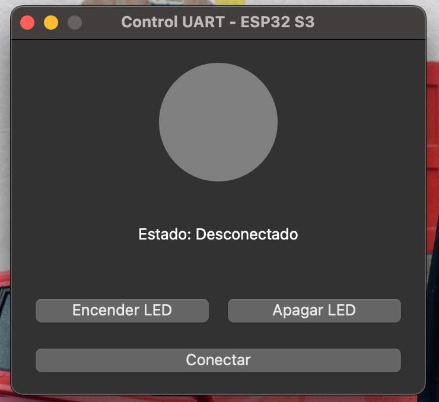
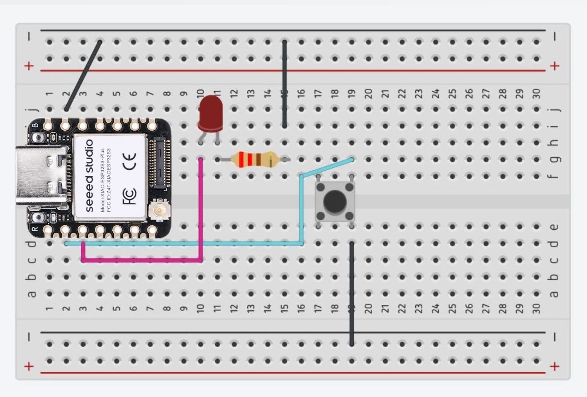
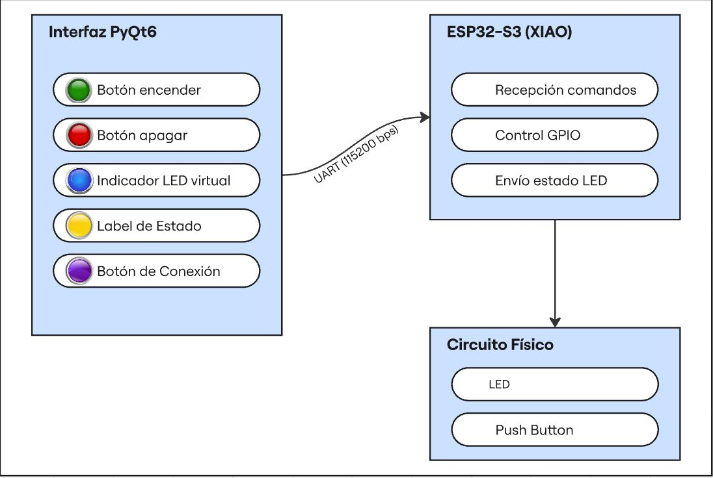
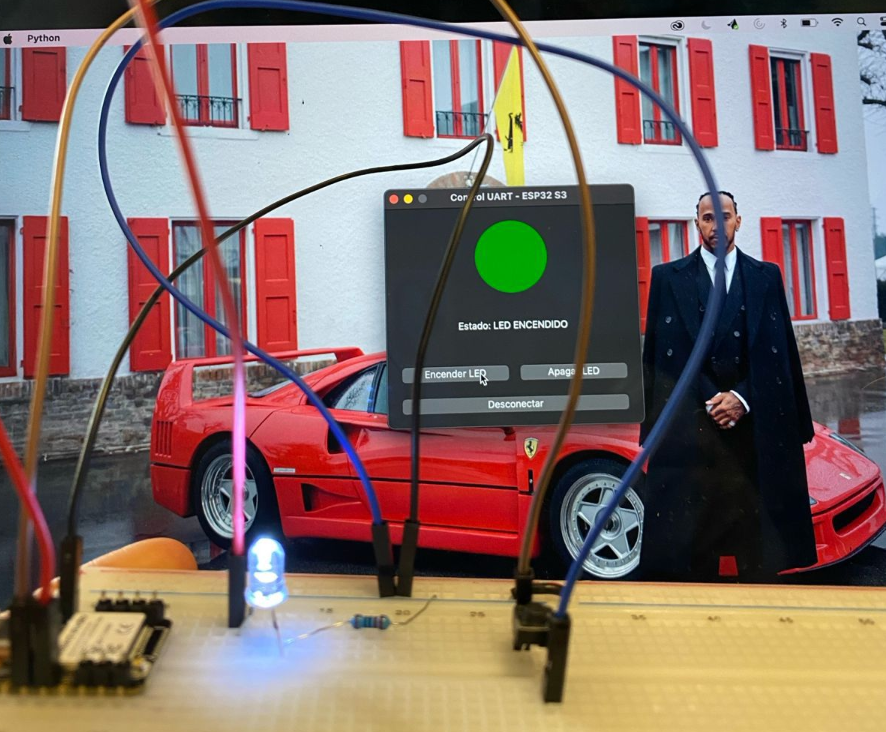

# Interfaces Gráficas (GUI) y Comunicación Inalámbrica (BLE)

En la ingeniería de sistemas ciberfísicos, la integración de hardware con **Interfaces Hombre-Máquina (HMI)** es fundamental. Este reporte detalla la creación de un sistema de control bidireccional utilizando el **ESP32-S3** y una interfaz desarrollada en **Python (PyQt6)**. Se analiza la evolución desde una comunicación cableada (UART) hacia una inalámbrica mediante **Bluetooth Low Energy (BLE)**.

---

## 2. Objetivos
* **General:** Diseñar un sistema de control que integre hardware y software, validando la integridad de datos en comunicación serie e inalámbrica.
    * Estructurar una GUI multihilo para evitar el bloqueo del renderizado.
    * Implementar un protocolo de mensajería para el control de GPIOs.
    * Configurar un servidor GATT en el ESP32-S3 para conexión BLE.

---

## 3. Tecnologías y Herramientas

### Arquitectura del XIAO ESP32-S3
El módulo Seeed Studio XIAO ESP32S3 destaca por su motor de aceleración de IA y su gestión avanzada de energía. Para este laboratorio, su relevancia radica en el soporte nativo de USB-Serial y su pila BLE 5.0, permitiendo pruebas de comunicación de alta velocidad.

### UART y el flujo de datos asíncrono
La comunicación UART (Universal Asynchronous Receiver-Transmitter) se basa en la sincronización por reloj interno entre dos nodos. En este proyecto, la UART permite una depuración directa y un flujo de datos bidireccional simple pero efectivo para comandos AT-Style.

### Bluetooth Low Energy (BLE) y Perfil GATT
A diferencia del Bluetooth clásico, BLE utiliza una jerarquía de datos:
* Servicios: Agrupaciones lógicas de funciones (identificadas por UUID).
* Características: Los puntos de datos finales donde se lee, escribe o se notifican cambios. El uso de Notificaciones es crítico aquí, ya que permite al servidor (ESP32) enviar datos al cliente (PC) sin que este los solicite explícitamente.

## 4. Componentes Usados 

| Componente | Especificación |
| :--- | :--- |
| MCU | XIAO ESP32-S3 (GPIO 2 como entrada, GPIO 3 como salida) |
| Entradas | Pulsador táctil con configuración INPUT_PULLUP |
| Salidas | LED difuso con resistencia limitadora de corriente de 220Ohms |
| IDE/Lenguaje | Arduino IDE 2.3 (C++) y VS Code (Python 3.11) |
| Librerías GUI | PyQt6 para la gestión de señales y slots |
| Librerías Comm | pyserial para UART y BLEDevice.h para el stack inalámbrico |

## 5. Desarrollo Técnico 
### Etapa 1. Diseño de la Interfaz y Wirefame
La GUI fue diseñada bajo el principio de separación de responsabilidades.
* **Visualización:** El widget led_indicator utiliza QSS (Qt Style Sheets) para renderizar un círculo con bordes redondeados (border-radius: 50px), emulando un LED físico.
* **Lógica de Conexión:** Se implementó un manejador de excepciones para el puerto **/dev/cu.usbmodem14101 (Mac/Linux)**, asegurando que la aplicación no colapse si el hardware se desconecta.

Wireframe del Sistema:
1. **Header**: Indicador de estado de conexión.
2. **Body**: Visualizador central (LED Virtual) y log de eventos.
3. **Footer**: Panel de control de comandos (ON/OFF) y botón de Toggle Serial.

### Etapa 2. Comunicación UART y Protocolo de Aplicación
En el código C++, se estableció una velocidad de 115200 baudios. La lógica del loop() prioriza la lectura del buffer serial:
    if (Serial.available()) {
        String cmd = Serial.readStringUntil('\n');
        cmd.trim();
        // Procesamiento de comandos
    }
La función **trim()** es vital para eliminar caracteres de escape (\r\n) que suelen corromper las comparaciones de cadenas de texto en C++.

### Etapa 3. Interacción Bidireccional (Físico-Virtual)
Esta es la etapa crítica del flujo de datos:
1. **Del Hardware a la GUI:** El ESP32 detecta un flanco de bajada (LOW) en el pin 2. Envía la cadena "LED_ON".

2. **En la PC:** El hilo read_serial en Python recibe la cadena. Debido a que los hilos secundarios no pueden modificar la interfaz directamente, se emite una señal: signals.led_on.emit().
3. **Actualización:** El hilo principal captura la señal y cambia el color del widget a verde.

### Etapa 4. Migración a Bluetooth (BLE)
El código fue reestructurado para dejar de ser un flujo serie y convertirse en un **Servidor de Atributos**.
* UUID de Servicio: 1234
* UUID de Característica: 5678 (Con propiedades de READ, WRITE y NOTIFY).
**Cambio Paradigmático:** En UART, usamos Serial.println(). En BLE, usamos pCharacteristic->setValue() seguido de pCharacteristic->notify(). Esto último es lo que permite que la GUI de Python (una vez adaptada con una librería como bleak) reciba el cambio instantáneamente.

### Etapa 5. Análisis de la Máquina de Estados (Firmware ESP32-S3) 
El software del sistema embebido opera bajo una arquitectura de super-loop con manejo de eventos. A diferencia de un programa secuencial, el ESP32-S3 evalúa constantemente dos vectores de entrada: el estado del hardware (GPIO) y el buffer de comunicaciones (Serial/BLE).

### Diagrama de Flujo Lógico
**Descripción del Flujo Operativo**
1. **Estado de Inicialización (Setup):**
* Configuración de registros de E/S: El GPIO 2 se define como INPUT_PULLUP para asegurar un nivel lógico alto constante en ausencia de pulsación.
* Inicialización del Stack de Comunicación: Se establece la tasa de 115200 baudios (UART) o se instancia el servidor GATT (BLE) con sus respectivos UUIDs.
* Estado Inicial: Se fuerza el LED_PIN a LOW para garantizar un estado conocido.
2. **Ciclo de Ejecución (Main Loop):**
* Subrutina de Monitoreo de Hardware: El sistema realiza un polling del BTN_PIN. Si se detecta una transición de HIGH a LOW (flanco de bajada), el sistema entra en una rutina de cambio de estado (toggle).
* Gestión de Debouncing: Se introduce una guarda de tiempo (delay no bloqueante o simple) para evitar el ruido mecánico del switch que podría disparar múltiples eventos de interrupción.
* Sincronización de Salida: Tras el cambio de estado local, se actualiza el GPIO 3 y se despacha un paquete de datos hacia la interfaz (Serial.println o pCharacteristic->notify).
3. **Manejador de Comandos Externos (HMI Interface):**
* El sistema interroga el buffer de recepción. Si existen datos pendientes, se realiza un parsing del String entrante.
* Determinismo Lógico: Solo si la cadena coincide exactamente con "ON" u "OFF", el procesador ejecuta la acción. Esto previene ejecuciones erróneas por ruido en la línea de transmisión.

## 6. Resultados y Evidencia 
**Análisis de Operación** 
Durante las pruebas, se comparó la latencia de ambos métodos.
* UART: Respuesta inmediata ($\approx$ 10ms).
* BLE: Respuesta fluida ($\approx$ 40ms), pero con la ventaja de inmunidad al ruido electromagnético ambiental al no requerir cables de datos.

Recursos Descargables:
* [GUI LED ESP32](assets/files/gui_led_esp32.py)
* [BLUE ESP32](assets/files/blue_esp.c)
* [Serial ESP32](assets/files/serialEsp.c)

*Funcionamiento del Wireframe:*
<video controls width="720">
  <source src="{{ '/assets/videos/Interfaz.mp4' | relative_url }}" type="video/mp4">
  Tu navegador no soporta video HTML5.
</video>

## 7. Análisis y Discusión 
1. **Robustez del Software (Threading)**
Un error común en reportes básicos es omitir por qué se usa threading. En este proyecto, si la lectura serial se hiciera en el hilo principal, la interfaz se "congelaría" mientras el puerto espera datos. El uso de daemon=True asegura que, al cerrar la ventana, el hilo de comunicación muera automáticamente, evitando procesos huérfanos.
2. **Estabilidad del Enlace (Debouncing)**
Se identificó que el pulsador físico generaba múltiples señales por un solo pulso (rebote). La solución fue un delay(200) en UART y 300 en BLE. En un entorno industrial, esto se mejoraría con un capacitor de desacoplo de $0.1\mu F$ o un disparador Schmitt.
3. **Limitaciones de la Migración**
El código de Python proporcionado usa pyserial, que es estrictamente para UART. Para que la migración a BLE sea funcional al 100% en la interfaz, se recomienda la integración de la librería bleak, ya que el puerto serie virtual por Bluetooth no siempre es estable en sistemas operativos modernos.
