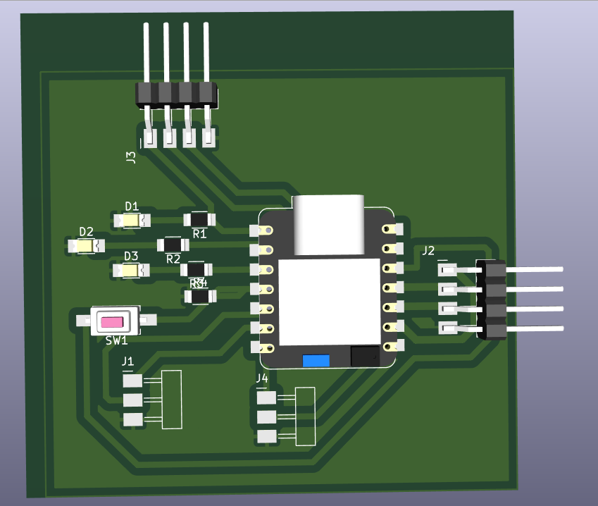
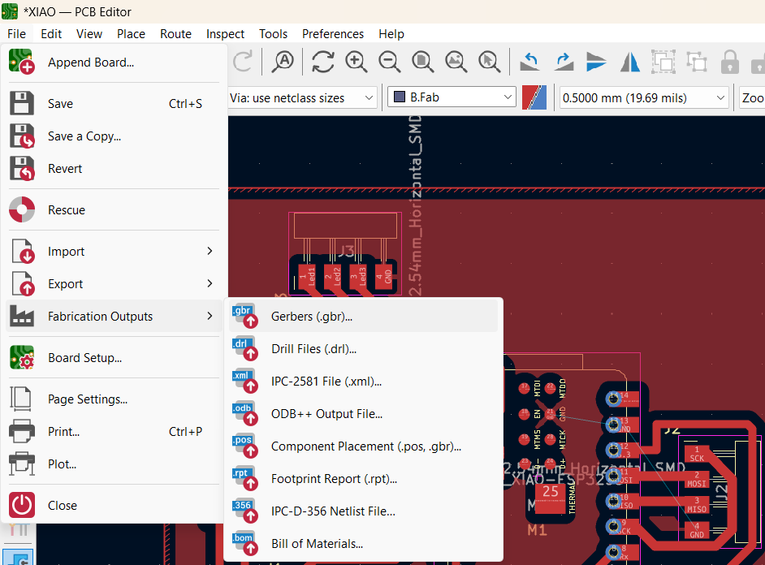
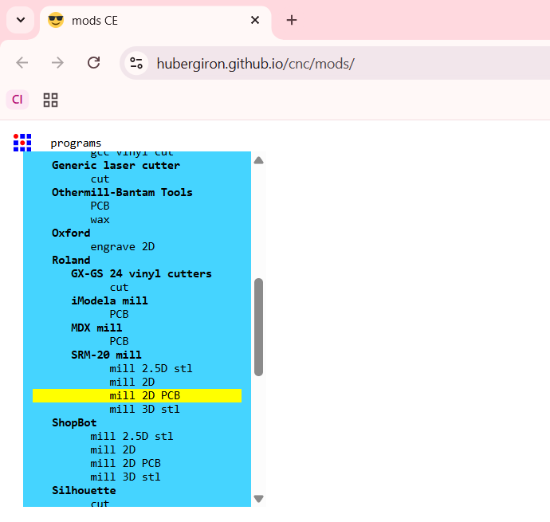
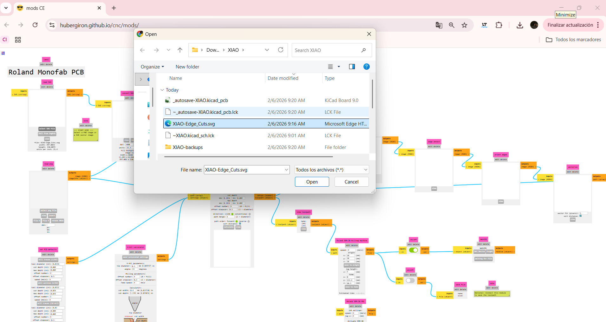
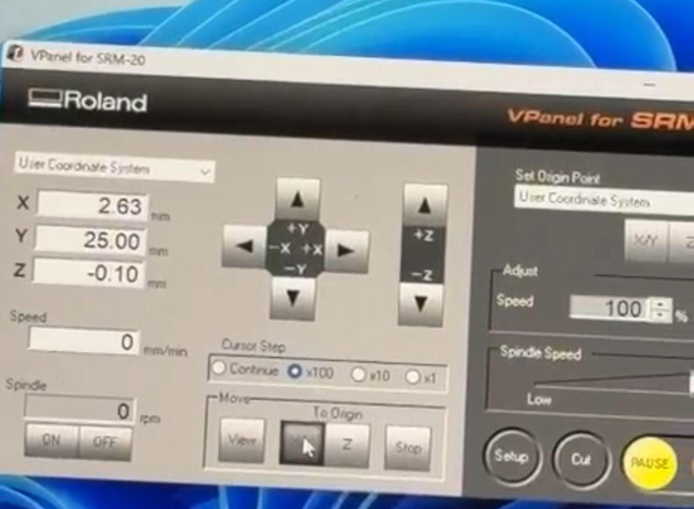
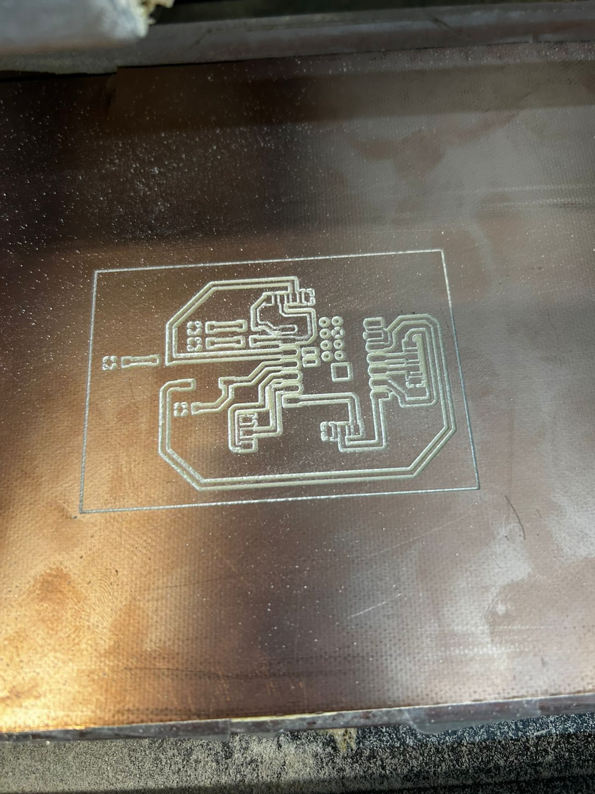

 
# Diseño y Elaboración de PBC´s

## 1. Introducción
El objetivo de esta fase es llevar el diseño electrónico del esquema. Para ello, se utiliza el flujo de trabajo de KiCad para el diseño y PCB para la fabricación profesional.

## 2. Diagrama Esquemático (KiCad)
Antes de la fabricación, se debe consolidar el diseño en el software. El circuito principal se basa en el **XIAO ESP32 S3** e incluye:
* **Interfaz FTDI:** Para la programación serie.
* **Indicadores LED:** Para pruebas de salida (Blink).
* **Botones de Control:** Para funciones de RESET y BOOT.

---

## 3. Pasos para la Fabricación (PCBWay / Warehouse)

A continuación, se describen los pasos necesarios para ordenar la placa siguiendo el flujo de trabajo del documento guía:

### Paso 1: KiCad Elaboración

### Paso 2: Selección y conexión de componentes

### Paso 3: Conexión de Componentes/Tierra

Vista 3D

### Paso 5: Archivo de Grabado/Corte 
Se deben exportar 2 archivos .svg, uno será usado para el grabado en la placa y el otro será el corte de la placa. 

### Paso 6: Mods CE para los .svg
En  esta sección se suben los archivos .svg (uno por uno) para modificar los parametros con los que se hará el grabado/corte de acuerdo a nuestra punta que se utlizará en la fresadora.

### Paso 7: Configuración Roland VPanel 
Después de guardar el archivo generado en Mods CE con las especificaciones para nuestra fresadora SRM-20, se abrirán los archivos (de igual manera uno por uno) en Roland Vpanel for SRM-20.

1. Definir el Punto de Origen (X, Y): Mueve la herramienta manualmente usando las flechas del software hasta la esquina inferior izquierda de tu placa.
2. Definir el Origen en Z: Baja la punta con cuidado hasta que toque la superficie de la placa de cobre (puedes usar un multímetro en continuidad para ser exacto).
3. Set Origin: Presiona los botones "X/Y" y "Z" en la sección de "User Coordinate" para guardar estas posiciones.

### Paso 8: Proceso de Fresado Grabado/Corte

1. Cargar Grabado: Selecciona el archivo de las pistas.
2. Cambio de Herramienta: La punta de corte debe ser de la medida según hayas estado poniendo en las especificaciones de diseño.
3. Cargar Corte: Selecciona el archivo de corte exterior.

## 4. Funcionamiento Final 

<video controls width="720">
  <source src="{{ '/assets/videos/PCB.mp4' | relative_url }}" type="video/mp4">
  Tu navegador no soporta video HTML5.
</video>