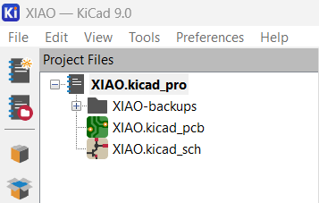
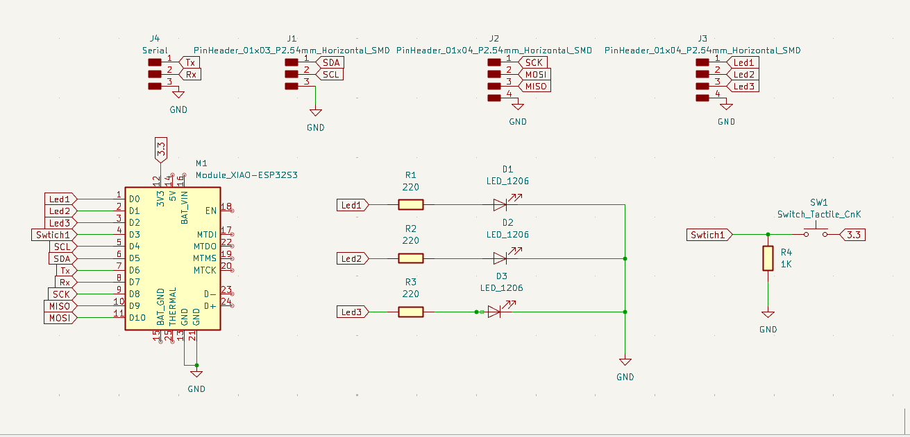
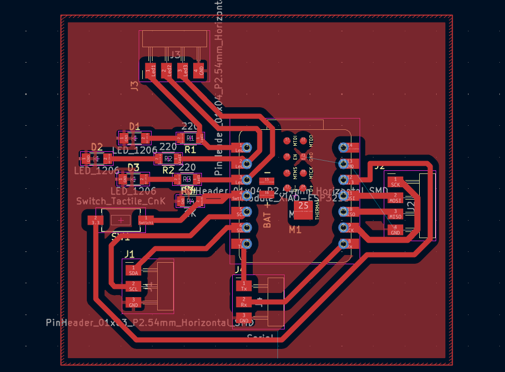
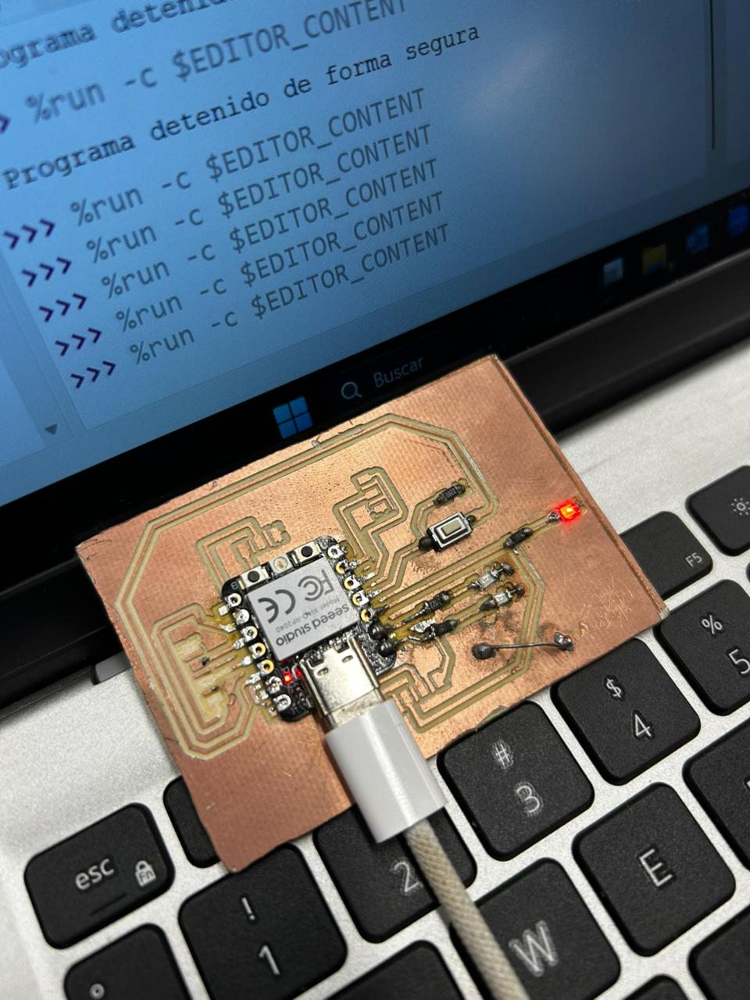

 
# Diseño y Elaboración de PBC´s

## 1. Introducción
El objetivo de esta fase es llevar el diseño electrónico del esquema. Para ello, se utiliza el flujo de trabajo de KiCad para el diseño y PCB para la fabricación profesional.

## 2. Diagrama Esquemático (KiCad)
Antes de la fabricación, se debe consolidar el diseño en el software. El circuito principal se basa en el **XIAO ESP32 S3** e incluye:
* **Interfaz FTDI:** Para la programación serie.
* **Indicadores LED:** Para pruebas de salida (Blink).
* **Botones de Control:** Para funciones de RESET y BOOT.

---

## 3. Pasos para la Fabricación (PCBWay / Warehouse)

A continuación, se describen los pasos necesarios para ordenar la placa siguiendo el flujo de trabajo del documento guía:

### Paso 1:

### Paso 2: 

### Paso 3:

### Paso 4: 

## 4. Funcionamiento Final 

<video controls width="720">
  <source src="{{ '/assets/videos/PCB.mp4' | relative_url }}" type="video/mp4">
  Tu navegador no soporta video HTML5.
</video>