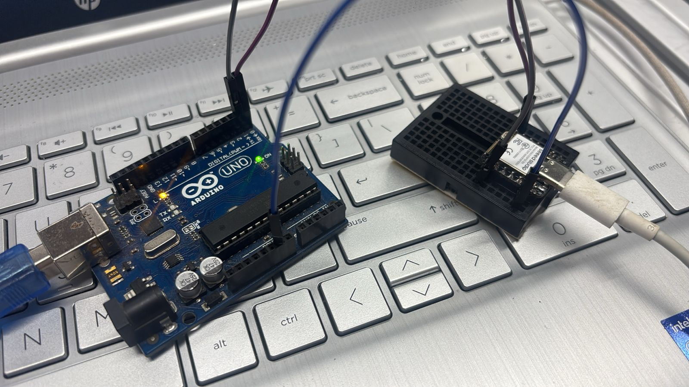
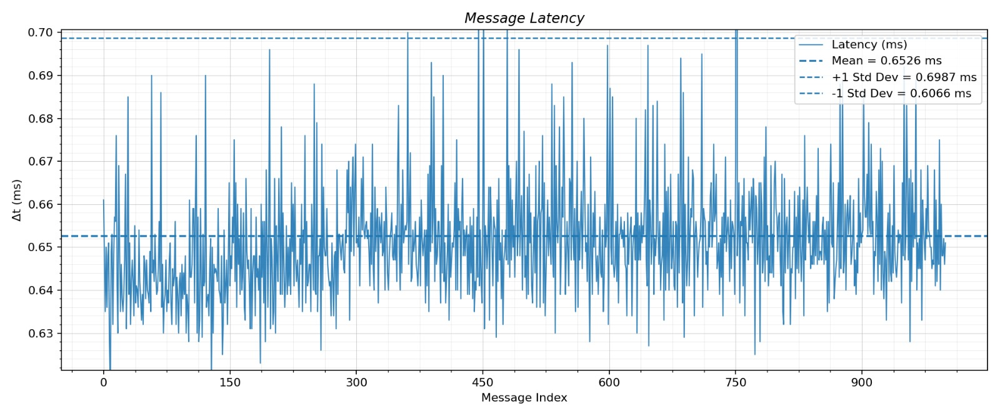
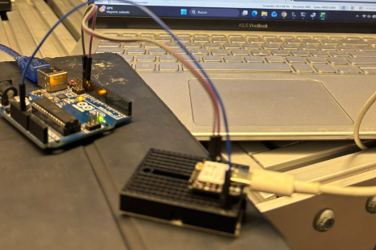
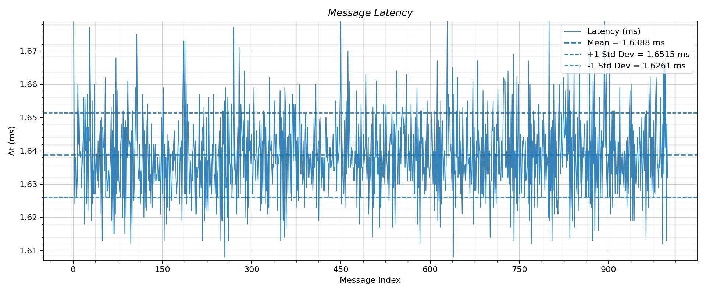
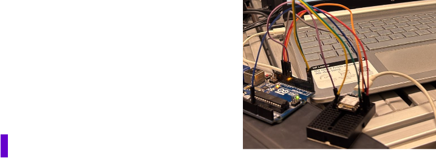
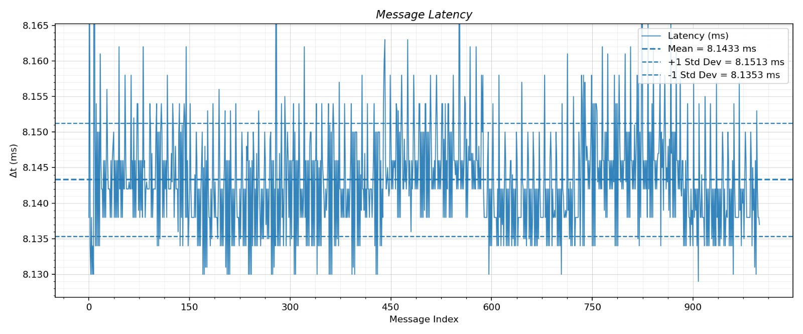

# Protocolos de Comunicación

## 1. ¿Qué es un Sistema Embebido?
A diferencia de una computadora personal, un **sistema embebido** es un sistema de computación diseñado para realizar funciones específicas o dedicadas, generalmente dentro de un sistema mecánico o eléctrico mayor.

**Características principales:**
* **Especialización:** Diseñados para una tarea concreta.
* **Eficiencia:** Optimizados para bajo consumo de energía y costo reducido.
* **Limitaciones técnicas:** Memoria y capacidad de procesamiento ajustadas a la necesidad del proyecto.
* **Interacción física:** Capacidad de leer sensores y controlar actuadores en el mundo real.

## 2. Protocolos de Comunicación Analizados
Para que los sistemas embebidos "hablen" entre sí o con otros periféricos, utilizan protocolos estándar. En esta práctica exploramos tres de los más importantes:

### A. UART (Universal Asynchronous Receiver-Transmitter)
Es un protocolo de comunicación serie **asíncrona**, lo que significa que no necesita una señal de reloj compartida.
* **Conexión:** Utiliza dos líneas principales, **TX** (transmisión) y **RX** (recepción).
* **Modo:** Full-duplex (puede enviar y recibir datos al mismo tiempo).
* **Uso común:** Consolas de depuración, módulos GPS y Bluetooth.

 [Resultado UART](https://marthavlds1.github.io/DocumentacionCiberfisicos/Practicas/Protocolos-de-Comunicaci%C3%B3n/#a-uart-universal-asynchronous-receiver-transmitter-1)

### B. I2C (Inter-Integrated Circuit)
Protocolo de tipo **síncrono** que utiliza una arquitectura Maestro-Esclavo.
* **Conexión:** Solo requiere dos hilos: **SDA** (datos) y **SCL** (reloj).
* **Ventaja:** Permite conectar múltiples dispositivos (hasta 127) usando el mismo par de cables mediante direcciones únicas.
* **Uso común:** Sensores de temperatura, acelerómetros y pantallas OLED.

[Resultado I2C](https://marthavlds1.github.io/DocumentacionCiberfisicos/Practicas/Protocolos-de-Comunicaci%C3%B3n/#b-i2c-inter-integrated-circuit-1)

### C. SPI (Serial Peripheral Interface)
Es el protocolo más rápido de los tres, operando de forma **síncrona** a altas velocidades.
* **Conexión:** Utiliza cuatro hilos (**MOSI, MISO, SCK, SS**).
* **Ventaja:** Transferencia de datos a muy alta velocidad sin la complejidad de direccionamiento de I2C.
* **Uso común:** Tarjetas SD, pantallas LCD de alta resolución y memorias Flash.

## 3. Plataformas de Prueba
En este reporte se comparó el rendimiento de tres arquitecturas distintas:
1. **ATMEGA328 (Arduino Nano/Uno):** Arquitectura de 8 bits, ideal para tareas sencillas.
2. **ESP32:** Potente procesador de 32 bits con conectividad Wi-Fi y Bluetooth integrada.
3. **RP2040 (Raspberry Pi Pico):** Procesador de doble núcleo con alta flexibilidad en sus pines de entrada/salida.

## 4. Resultados de la Práctica 1: Latencia y Baudrate
> **Instrucciones:** Identifica el baudrate máximo de cada plataforma y mide el tiempo que tarda un mensaje en llegar de un dispositivo a otro tras 1000 envíos.

### A. UART (Universal Asynchronous Receiver-Transmitter)
* **Códigos.** 

* **Conexión.** 

XIAO ESP32-S3 (Pin 43 TX) → Arduino Uno (Pin 0 RX)

XIAO ESP32-S3 (Pin 44 RX) → Arduino Uno (Pin 1 TX)

GND → GND

* **Análisis de los Datos.** 

Mensajes Enviados: 1,000

Latencia Promedio: 0.6526 mssegundos.

En el gráfico, las líneas punteadas azules muestran el rango de una desviación estándar por encima y por debajo de la media (0.6987 ms y 0.6066 ms, respectivamente), donde se encuentra la mayoría de los mensajes.

### B. I2C (Inter-Integrated Circuit)
* **Códigos.** 

* **Conexión.** 

XIAO ESP32-S3 (SDA - Pin 5) → Arduino Uno (A4 / SDA)

XIAO ESP32-S3 (SCL - Pin 6) → Arduino Uno (A5 / SCL)

GND → GND

* **Análisis de los Datos.** 

Mensajes Enviados: 1,000

Latencia Promedio: 1.6515 ms.

Este gráfico muestra una latencia promedio muy consistente con una desviación estándar baja, lo que indica que el sistema es muy estable, ya que la mayoría de los mensajes tienen tiempos de respuesta muy cercanos a la media.

### C. SPI (Serial Peripheral Interface)
* **Códigos.** 

* **Conexión.** 

XIAO ESP32-S3 (SCK - Pin 18) → Arduino Uno (Pin 13)

XIAO ESP32-S3 (MISO - Pin 19) → Arduino Uno (Pin 12)

XIAO ESP32-S3 (MOSI - Pin 23) → Arduino Uno (Pin 11)

XIAO ESP32-S3 (CS - Pin 5) → Arduino Uno (Pin 10)

GND → GND

* **Análisis de los Datos.** 

Mensajes Enviados: 1,000

Latencia Promedio: 8.1513 ms.

Este gráfico muestra una dispersión mayor de los puntos de datos alrededor de la media, con picos ocasionales de latencia de hasta 0.75 segundos. Esto indica una mayor variabilidad.
