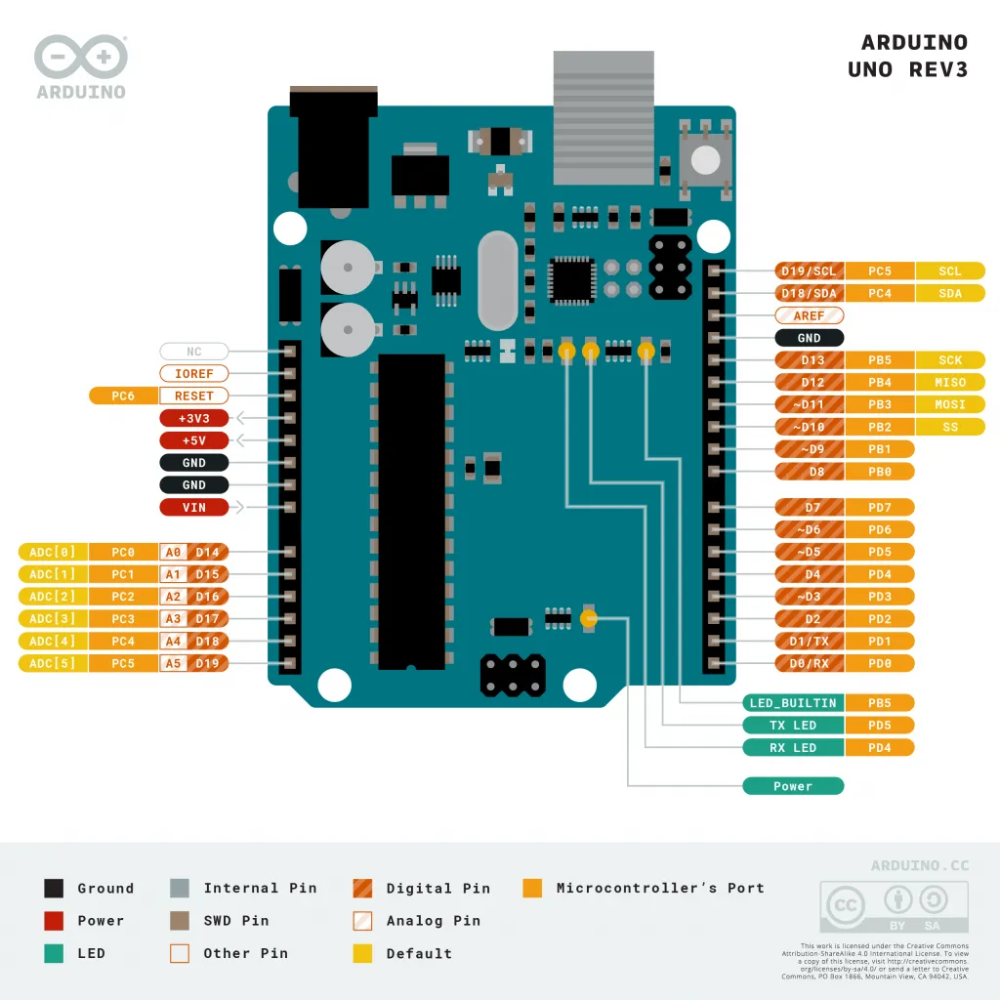
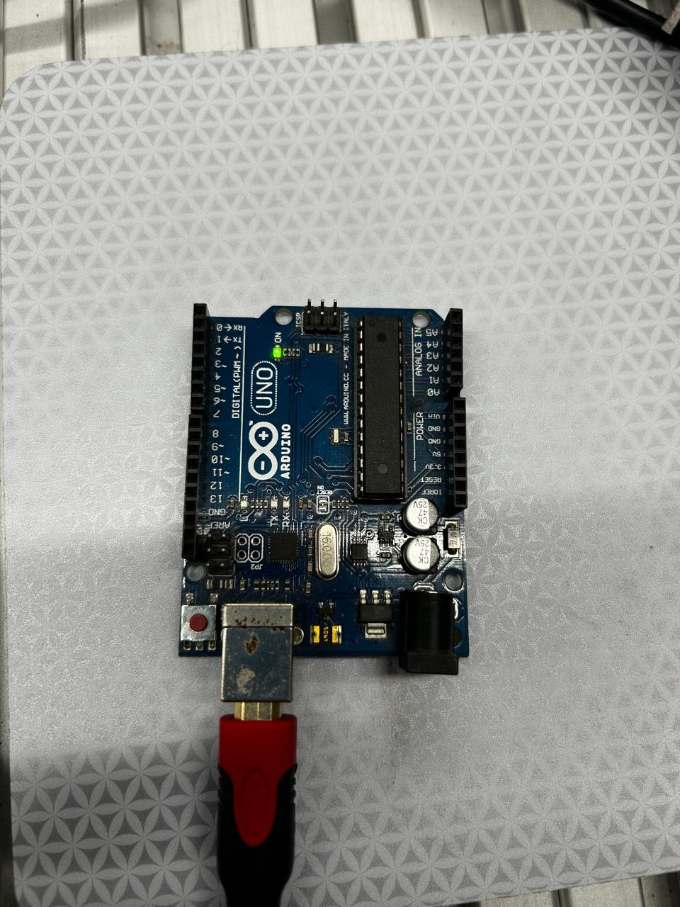

# Sistemas Embebidos 

Los sistemas embebidos son sistemas de computación basados en microprocesadores o microcontroladores, diseñados para realizar funciones dedicadas y específicas. Estos sistemas están optimizados para ejecutar tareas concretas en tiempo real.

## Entorno de Programación

## Microcontroladores

## Uso de microcontroladores
### Arduino Uno (ATmega328P)

### Arduino Nano (ATmega328P)
### XIAO RP2040
### ESP32 DevKit V1 (ESP32‑WROOM‑32)
### XIAO ESP32S3 Sense