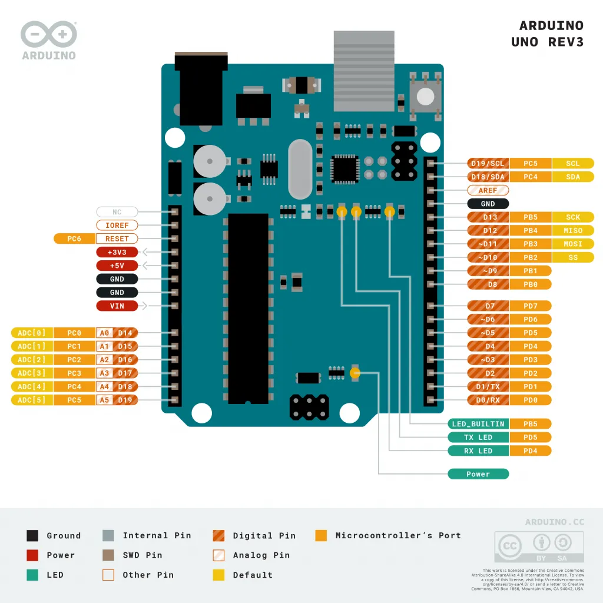
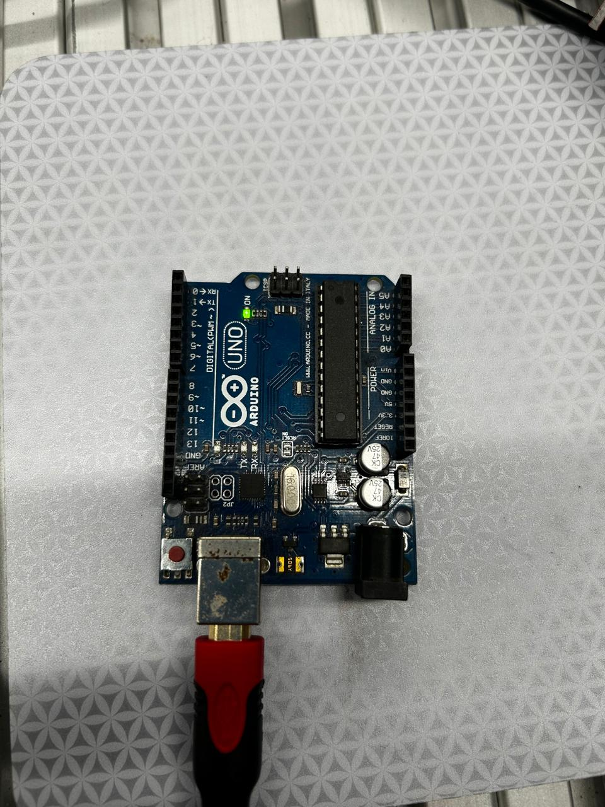

# Reporte: Programación de Microcontroladores

## 1. ¿Qué son los sistemas embebidos?
Los **sistemas embebidos** son sistemas de cómputo diseñados para ejecutar una función específica dentro de un sistema más amplio. A diferencia de una computadora de propósito general, un sistema embebido se integra directamente a un dispositivo físico y está optimizado para realizar tareas concretas como:
* **Control y Monitoreo**
* **Adquisición de datos**
* **Comunicación con otros sistemas**

Estos sistemas combinan **hardware** (microcontroladores, sensores, actuadores) y **software**, operando bajo restricciones de tiempo real, consumo energético y memoria. En el contexto de los **sistemas ciberfísicos**, actúan como el nexo entre el mundo físico y el digital.

---

## 2. Sistemas Embebidos utilizados en la práctica
Durante la práctica se trabajó con diversas plataformas de desarrollo para comparar su funcionamiento, capacidades y herramientas de programación.

### Descripción de las plataformas:

* **Arduino Uno / Arduino Nano (ATmega328P):** * Arquitectura AVR de 8 bits. 
    * Ideal para aprendizaje básico de pines digitales, entradas analógicas y temporizadores.
* **Seeed Studio XIAO RP2040:** * Arquitectura ARM Cortex-M0+ de doble núcleo. 
    * Alta flexibilidad para periféricos y compatible con MicroPython.
* **ESP32 DevKit V1 (ESP32-WROOM-32):** * Arquitectura Xtensa LX6 de doble núcleo. 
    * Incorpora Wi-Fi y Bluetooth, ideal para Internet de las Cosas (IoT).
* **Seeed Studio XIAO ESP32S3 Sense:** * Arquitectura Xtensa LX7. 
    * Incluye sensores integrados y soporte para visión artificial básica.

### Tabla Comparativa de Hardware

| Plataforma | Microcontrolador | Arquitectura | Núcleos | Conectividad | Uso Principal |
| :--- | :--- | :--- | :---: | :---: | :--- |
| **Arduino Uno / Nano** | ATmega328P | AVR 8-bit | 1 | No | Educación y control básico |
| **XIAO RP2040** | RP2040 | ARM Cortex-M0+ | 2 | No | Prototipado avanzado |
| **ESP32 DevKit V1** | ESP32-WROOM-32 | Xtensa LX6 | 2 | Wi-Fi / BT | IoT y sistemas conectados |
| **XIAO ESP32S3 Sense** | ESP32-S3 | Xtensa LX7 | 2 | Wi-Fi / BT | Sistemas ciberfísicos |

---

## 3. Software y Lenguajes de Programación

### Arduino IDE
Entorno principal utilizado para todas las plataformas. Permite programar en **C/C++**, ofreciendo acceso directo al hardware y configuración de periféricos como GPIO y comunicación serial.

### MicroPython (Thonny)
Utilizado para las plataformas **RP2040** y **ESP32**. Este lenguaje de alto nivel permite una programación más rápida y legible, ideal para el desarrollo inicial y pruebas de lógica.

---

## 4. Práctica y Resultados Obtenidos

Se llevó a cabo la configuración de los entornos de desarrollo y la carga del programa **Blink** (encendido y apagado periódico de un LED). Esta prueba permitió verificar:
1. El correcto funcionamiento de cada microcontrolador.
2. La correcta asignación de pines.
3. El uso de instrucciones básicas de control.

### Evidencia de funcionamiento (Resultados)

#### ATmega328P (Arduino)
> *[Inserta aquí la foto o video de tu Arduino haciendo Blink]*

#### RP2040
> *[Inserta aquí la foto o video de tu XIAO RP2040 haciendo Blink]*

#### ESP32
> *[Inserta aquí la foto o video de tu ESP32 haciendo Blink]*

---
*Reporte generado para la asignatura de Sistemas Ciberfísicos.*

## Uso de microcontroladores
### Arduino Uno (ATmega328P)

### Arduino Nano (ATmega328P)
### XIAO RP2040
### ESP32 DevKit V1 (ESP32‑WROOM‑32)
### XIAO ESP32S3 Sense