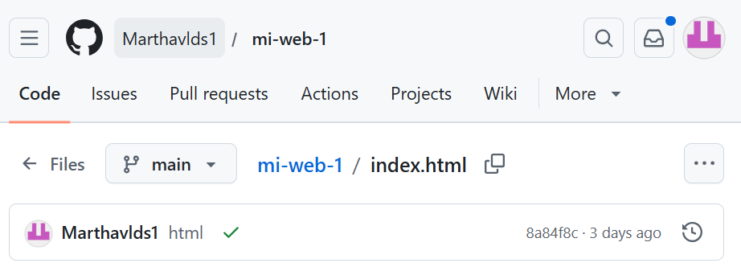
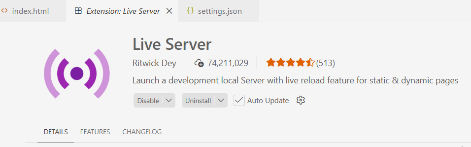
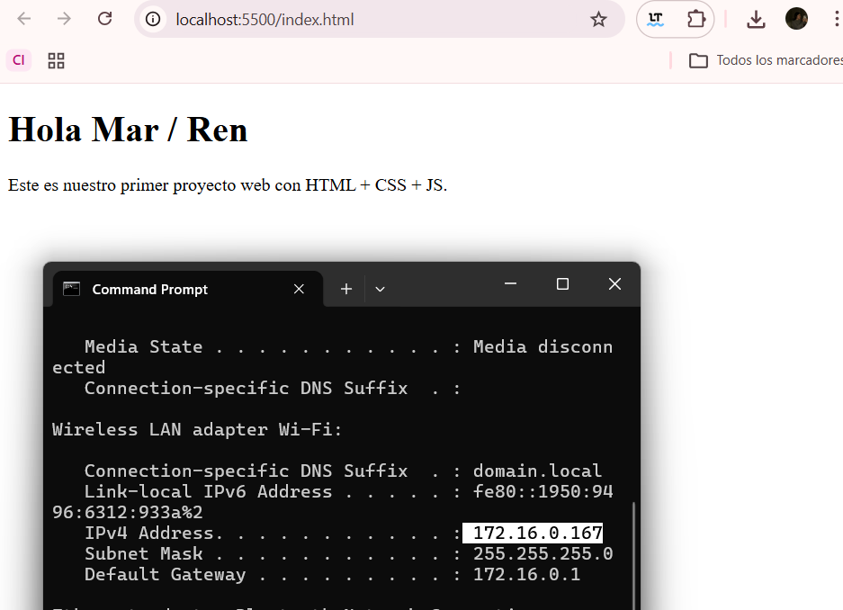
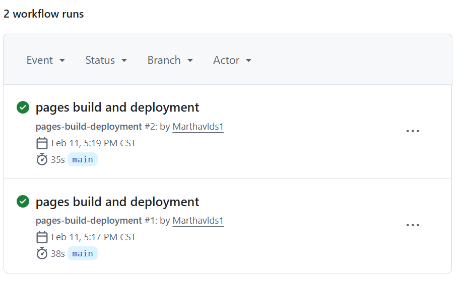
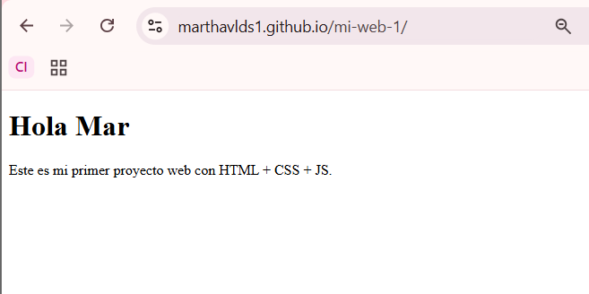
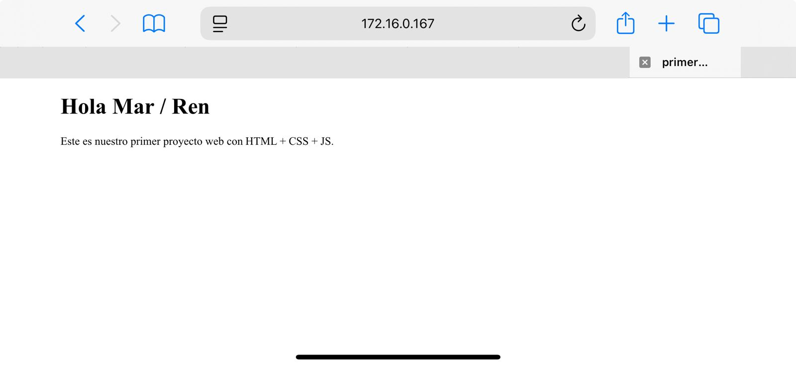

# Despliegue Web: GitHub Pages y Servidores Locales (Live Server)

La capacidad de comunicar datos de sistemas embebidos requiere interfaces accesibles. Esta práctica documenta el proceso de creación, gestión y publicación de un sitio web desde cero, explorando tanto el despliegue en la nube mediante **GitHub Pages** como la exposición de servicios en red local a través de una **IP estática/local**.

---

## 1. Conceptos Fundamentales
Para comprender el flujo de trabajo moderno de desarrollo web, se definieron los siguientes pilares:
* **Repositorio (Repo):** Contenedor digital que almacena el historial de cambios del proyecto.
* **Codespaces:** Entorno de desarrollo integrado (IDE) basado en la nube que permite programar sin instalaciones locales.
* **Pipeline (Actions):** Procesos automáticos que compilan y despliegan el código tras cada actualización.
* **Live Server:** Herramienta que convierte una estación de trabajo en un nodo servidor dentro de una red local (LAN).

---

## 2. Tecnologías y Herramientas

| Componente | Especificación |
| :--- | :--- |
| **Lenguaje** | HTML5 (Estructura) |
| **Entorno de Desarrollo** | GitHub Codespaces / VS Code |
| **Host Remoto** | GitHub Pages (Servidor Nube) |
| **Host Local** | Live Server Extension (Protocolo TCP/IP) |
| **Puerto Local** | 5500 (Configuración por defecto) |

---

## 3. Desarrollo Técnico

### Etapa 1. Creación del Repositorio y Entorno
Se inició un repositorio limpio en GitHub con visibilidad pública. El uso de **Codespaces** permitió generar la estructura base de forma inmediata.

**Estructura mínima:**
index.html

### Etapa 2. Codificación del Documento Estructural
Se redactó el archivo index.html utilizando etiquetas semánticas básicas. Este archivo sirve como el punto de entrada (Entry Point) tanto para el servidor remoto como para el local.
Recursos: [Código generado HTML](assets/files/index.html)
    <!doctype html>
    <html>
    <head>
        <title>Mi primera página</title>
    </head>
    <body>
        <h1>Hola Mar / Ren</h1>
        
Este es nuestro primer proyecto web con HTML + CSS + JS.

    </body>
    </html>

### Etapa 3. Despliegue en la Nube (GitHub Pages)
Tras realizar el Commit (guardado de cambios) y el Push (subida a la nube), se activó el servicio de GitHub Pages en los ajustes del repositorio.
1. **Branch:** main
2. **Folder:** / (root)
3. **URL generada:** https://TU_USUARIO.github.io/mi-web-01/

### Etapa 4. Configuración del Servidor Local y Exposición por IP
Para pruebas de desarrollo rápido e interconexión con otros dispositivos en la misma red (como un ESP32 o un smartphone), se utilizó la extensión **Live Server**.

1. **Configuración del Puerto**
De acuerdo a la documentación de la librería, se modificó el archivo de ajustes para asegurar la estabilidad del socket:

2. **Código en JSON:**
    {
    "liveServer.settings.port": 5500,
    "liveServer.settings.host": "localhost"
    }

3. **Acceso mediante IP**
Al ejecutar "Open with Live Server" desde Visual Studio Code, el sitio se vuelve accesible no solo en la máquina local (127.0.0.1), sino en cualquier dispositivo conectado a la misma red WiFi utilizando la dirección IP de la computadora seguida del puerto asignado.

**Ejemplo de acceso:** http://172.16.0.167:5500

### Etapa 5. Resultados y Evidencia 
* **GitHub Actions**

Workflow en verde (Success)

* **Despliegue Online**

Visualización en dominio .github.io

* **Acceso Local**

Acceso desde smartphone vía IP: **http://172.16.0.167:5500**

**Nota Técnica:** Para que el acceso por IP funcione desde otros dispositivos, es necesario verificar que el Firewall de la computadora permita conexiones entrantes por el puerto 5500.
Y tener la misma conexión de internet.

### Etapa 6. Análisis y Discusión
1. Diferencia entre Host Local y Remoto
Mientras que GitHub Pages ofrece disponibilidad global y persistente, Live Server es ideal para la depuración en tiempo real de sistemas embebidos que interactúan con la red local.

2. Integración con Sistemas Ciberfísicos
Esta configuración es la base para crear Dashboards de Control. Un microcontrolador (como el ESP32) podría realizar peticiones HTTP a la IP local configurada o servir datos que la página HTML visualice mediante JavaScript.

3. Automatización (CI/CD)
El uso de GitHub Actions demuestra cómo el desarrollo moderno elimina la necesidad de subir archivos manualmente vía FTP, automatizando el ciclo de vida del software.